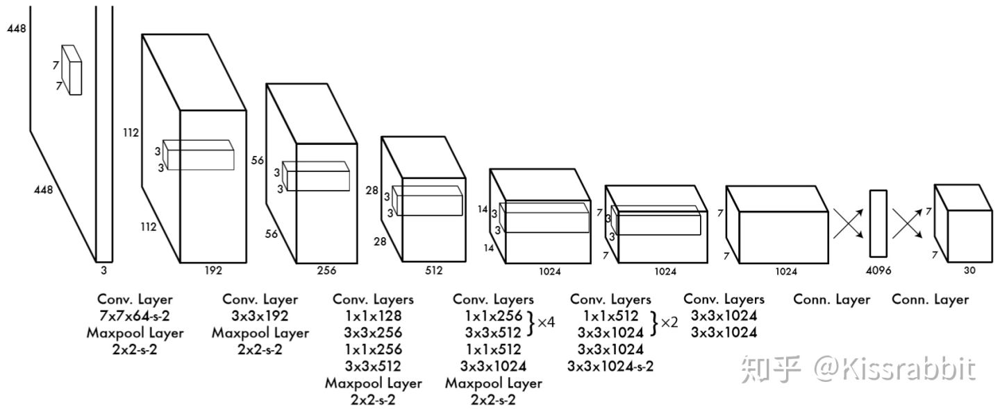

<!-- @import "[TOC]" {cmd="toc" depthFrom=1 depthTo=6 orderedList=false} -->

<!-- code_chunk_output -->

- [yolo_v1 (2015 one stage)](#yolo_v1-2015-one-stage)
- [Detector = Backbone + Neck + Head](#detector-backbone-neck-head)
- [YOLO_V2 (TODO)](#yolo_v2-todo)
- [YOLO_V3](#yolo_v3)
- [YOLO_V4](#yolo_v4)

<!-- /code_chunk_output -->

### yolo_v1 (2015 one stage)

One-Stage工作的最大特点就是：仅使用单一的网络，端到端地给出输入图像中物体的位置和类别。这一特点就决定了这一类工作在速度上的优势，现在基本上提到实时性，大多数人都先想到这一类的工作。

主要特点:
- 使用全连接层最为最后几层的特征提取，参数量庞大
- 没有使用BN层防止过拟合
- 需要对网络进行预热

网络最后的输出为$7*7*30$，首先是$7*7$表示网络输出的特征图大小为$7*7$，图片的原始输入为$448*448$，即图像被下采样了$448/7=64$倍。特征图上的每个像素点含有三十个通道(正常的图像为1，3或4个通道)。三十个通道的组成为目标类别的数量(S)加上特征图上的像素点预测的bbox(border box)的数量*5(每个bbox包含5个参数，分别为框的置信度C，框的中心点坐标$c_x, c_y$，以及框的宽高$w, h$)。则对于目标数据集的输出特征图通道数量的计算公式为$5B+C$。

### Detector = Backbone + Neck + Head

YOLO由三部分组成， 
- 第一部分Backbone主要负责特征提取，在此阶段Pretrained ImageNet或者重新训练的Feature Extractor都是可以的
- 第二部分主要是一些特征融合的小trick，如ASFF, RFB, SPP等
- 第三部分主要负责物体的定位及分类，这一部分不是特别了解，有待查阅

第一部分即特征提取器的性能直接可以决定最终网络检测能力的性能。

### YOLO_V2 (TODO)

### YOLO_V3

### YOLO_V4
