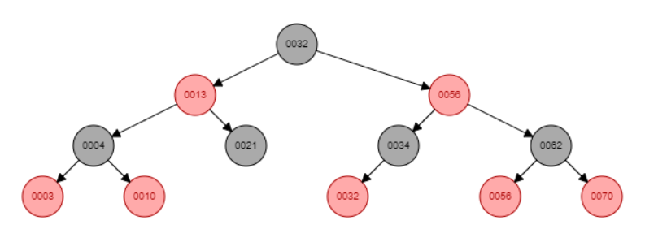
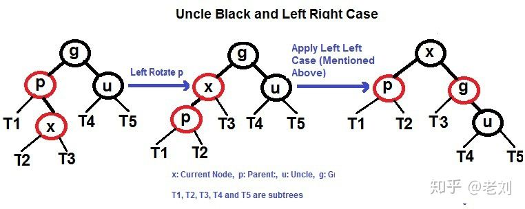
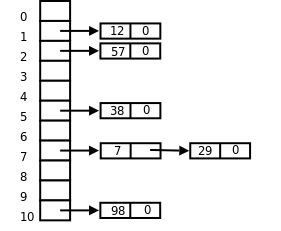

<!-- @import "[TOC]" {cmd="toc" depthFrom=1 depthTo=6 orderedList=false} -->

<!-- code_chunk_output -->

- [计算机基础](#计算机基础)
  - [红黑树](#红黑树)
    - [红黑树的插入与查询](#红黑树的插入与查询)
    - [红黑树与平衡二叉树的区别](#红黑树与平衡二叉树的区别)
  - [哈希表及常见的冲突解决方法](#哈希表及常见的冲突解决方法)
    - [哈希表概念](#哈希表概念)
    - [哈希表冲突解决办法](#哈希表冲突解决办法)
    - [HashMap与红黑树](#hashmap与红黑树)
  - [广义表](#广义表)
  - [中缀表达式](#中缀表达式)
  - [堆空间、栈空间](#堆空间-栈空间)
    - [什么是堆栈](#什么是堆栈)
    - [栈、堆的区别](#栈-堆的区别)
  - [References](#references)

<!-- /code_chunk_output -->

### 计算机基础

#### 红黑树

红黑树，Red-Black Tree 「RBT」是一个自平衡(不是绝对的平衡)的二叉查找树(BST)，树上的每个节点都遵循下面的规则:

1. 每个节点都有红色或黑色
2. 树的根始终是黑色的 (黑土地孕育黑树根， )
3. 没有两个相邻的红色节点（红色节点不能有红色父节点或红色子节点，并没有说不能出现连续的黑色节点）
4. 从节点（包括根）到其任何后代NULL节点(叶子结点下方挂的两个空节点，并且认为他5. 们是黑色的)的每条路径都具有相同数量的黑色节点

<a src="https://rbtree.phpisfuture.com/"><strong></strong>图 红黑树动画演示</a>

##### 红黑树的插入与查询

红黑树的查询首先遵守普通二叉排序树的插入规则，区别在于插入后需要进行适度的调整。

红黑树的插入大体上有如下几种情况：
- 空树，直接插入为根节点，标记为黑色
- 父节点和叔叔节点都为红色节点，此时将两节点标记为黑色，并将自己和祖父节点标记为红色，如果祖父节点为根节点则将祖父节点再标记为黑色。全过程不涉及数的结构的变化
- 父节点和叔叔节点为一黑一红两个节点，且红色节点端下接了一个红色节点，此时的调整方案与平衡二叉树貌似是一致的。共分为四种情况，两类，一类可以直接拎起来，把中间节点转化为父亲节点；另一类需要调整子节点顺序与父节点组成一条线再拎起来。

<strong>图 红黑树插入的第一类情况 直接拎</strong>

---

<strong>图 红黑树插入的第二类情况 先转化再拎</strong>

##### 红黑树与平衡二叉树的区别

平衡二叉树保证了在最差的情况下，二叉树依然能够保持绝对的平衡，即左右两个子树的高度差的绝对值不超过1。但是这又会带来一个问题，那就是平衡二叉树的定义过于严格，导致每次插入或者删除一个元素之后，都要去维护二叉树整体的平衡，这样产生额外的代价又太大了。**二叉搜索树可能退化成链表，而平衡二叉树维护平衡的代价开销又太大了**，那怎么办呢？这就要谈到“中庸之道”的智慧了。说白了就是把平衡的定义适当放宽，不那么严格，这样二叉树既不会退化成链表，维护平衡的开销也可以接受。没错，这就是我们要谈的红黑树了。

红黑树不像平衡二叉树树一样追求绝对的平衡，他允许局部很少的不完全平衡，这样对于效率影响不大，但省去了很多没有必要的调平衡操作，平衡二叉树树调平衡有时候代价较大，所以效率不如红黑树，在现在很多地方都是底层都是红黑树的天下啦~

#### 哈希表及常见的冲突解决方法

##### 哈希表概念

哈希表，也称散列表，从根本上来说，一个哈希表包含一个数组，通过特殊的关键码(也就是key)来访问数组中的元素。哈希表的主要思想是通过一个哈希函数， 把关键码映射的位置去寻找存放值的地方 ，读取的时候也是直接通过关键码来找到位置并存进去。用公式来表达就是：$f(key)$，而这样的函数所建立的表就是哈希表。比起数组和链表查找元素时需要遍历整个集合的情况来说，哈希表明显方便和效率的多。

因此，对于哈希表，其性能主要取决于哈希函数的设计。常见的哈希算法(函数)有如下几种：

- 直接定址法 --- 取关键字或关键字的某个线性函数值为散列地址取关键字或关键字的某个线性函数值为散列地址，$f(key) = a*key + b$
- 除留余数法 --- 取关键字被某个不大于散列表长度 m 的数 p 求余，得到的作为散列地址，$ f(key)=key \% p, p < m$
- 数字分析法 --- 当关键字的位数大于地址的位数，对关键字的各位分布进行分析，选出分布均匀的任意几位作为散列地址
- 平方取中法 --- 先计算出关键字值的平方，然后取平方值中间几位作为散列地址
- 随机数法 --- 选择一个随机函数，把关键字的随机函数值作为它的哈希值

##### 哈希表冲突解决办法

一般来说，哈希冲突是无法避免的，如果要完全避免的话，那么就只能一个字典对应一个值的地址，也就是一个字就有一个索引 (安 和 按就是两个索引)，这样一来，空间就会增大，甚至内存溢出。常见的哈希冲突解决办法有两种，开放地址法和链地址法。

开放地址法的做法是，当冲突发生时，使用某种探测算法在散列表中寻找下一个空的散列地址，只要散列表足够大，空的散列地址总能找到。按照探测序列的方法，一般将开放地址法区分为线性探查法、二次探查法、双重散列法等。

- 线性探查法 --- 探查时从地址d开始，首先探查T[d]，然后依次探查T[d+1]，…，直到T[m-1]，此后又循环到T[0]，T[1]，…，直到探查到有空余的地址或者到T[d-1]为止。缺点是需要不断处理冲突，无论是存入还是査找效率都会大大降低。

- 二次探查法 --- 探查时从地址d开始，首先探查T[d]，然后依次探查T[d+di]，di为增量序列，直到探查到有空余地址或者到T[d-1]为止。

- 双哈希函数探测法 --- 双哈希函数探测法，先用第一个函数 f(key) 对关键码计算哈希地址，一旦产生地址冲突，再用第二个函数 g(key) 确定移动的步长因子，最后通过步长因子序列由探测函数寻找空的哈希地址。

- 链地址法 --- 如果节点12和节点0的位置冲突了，然后我们把该数组的每一个元素变成了一个链表头，冲突的元素放在了链表中，这样在找到对应的链表头之后会顺着链表找下去，至于为什么采用链表，是为了节省空间，链表在内存中并不是连续存储，所以我们可以更充分地使用内存。

<strong>图 链地址法图解</strong>

##### HashMap与红黑树

HashMap中的值都是key，value。其实这里的存储与哈希表的很像，key会被映射成数据所在的地址，而value就在以这个地址为头的链表中，这种数据结构在获取的时候就很快。但这里存在的问题就是如果hash桶较小，数据量较大，就会导致链表非常的长。比如说上面的长为11的空间我要放1000个数，无论Hash函数如何精妙，后面跟的链表都会非常的长，这样Hash表的优势就不复存在了，反而倾向于线性检索。

在jdk1.8版本后，java对HashMap做了改进，在**链表长度大于8的时候**，将后面的数据存在红黑树中，以加快检索速度。

#### 广义表

#### 中缀表达式

#### 堆空间、栈空间

##### 什么是堆栈

- 栈区（stack）：又编译器自动分配释放，**存放函数的参数值，局部变量的值**等，其操作方式类似于数据结构的栈。

- 堆区（heap）：一般是由程序员分配释放，若程序员不释放的话，程序结束时可能由OS回收，值得注意的是他与数据结构的堆是两回事，**分配方式类似于数据结构的链表**。

##### 栈、堆的区别

- 分配方式不同。前者由系统分配；后者由程序员自己分配和定义。
- 申请方式不同。前者由系统自动分配；后者由程序员自己申请，C语言中使用malloc进行申请。
- 响应方式不同。**对于栈来讲**，只要栈的剩余内存足够，系统会自动为程序提供内存；**对于堆来讲**，首先应该知道操作系统有一个记录内存地址的链表，当系统收到程序的申请时，会遍历该链表，寻找第一个空间大于所申请的空间的堆结点，然后将该结点从空闲结点链表中删除，并将该结点的空间分配给程序。另外，对于大多数系统，**会在这块内存空间中的首地址处记录本次分配的大小**，这样代码中的delete或free语句就能够正确的释放本内存空间。另外，由于找到的堆结点的大小不一定正好等于申请的大小，系统会将多余的那部分重新放入空闲链表中。
- 申请的大小和效率不同。在windows下，栈是向低地址扩展的数据结构，是一块连续的内存区域，栈顶的地址和栈的最大容量是系统预先规定好的，能**从栈获得的空间较小**；堆是向高地址扩展的数据结构，是不连续的内存区域，这是由于系统是由链表在存储空闲内存地址，自然**堆就是不连续的内存区域**，且链表的遍历也是从低地址向高地址遍历的，堆得大小受限于计算机系统的有效虚拟内存空间，由此空间，**堆获得的空间比较灵活，也比较大**。

#### References

- [面试常见的几个问题如何回答才能最得体？](https://www.zhihu.com/question/22204669)
- [字节跳动算法实习 一二三面面经分享（已offer）](https://www.nowcoder.com/discuss/427544?type=2&order=0&pos=10&page=1&channel=1006&source_id=discuss_tag)
- [为什么要有红黑树？什么是红黑树？画了20张图，看完这篇你就明白了](https://zhuanlan.zhihu.com/p/103306156)
- [红黑树，超强动静图详解，简单易懂](https://zhuanlan.zhihu.com/p/79980618)
- [红黑树动画在线演示](https://rbtree.phpisfuture.com/)
- [数据结构：哈希表以及哈希冲突的解决方案](https://www.cnblogs.com/yeya/p/9845910.html)
- [堆空间与栈空间的区别](https://blog.csdn.net/mormont/article/details/53511441)