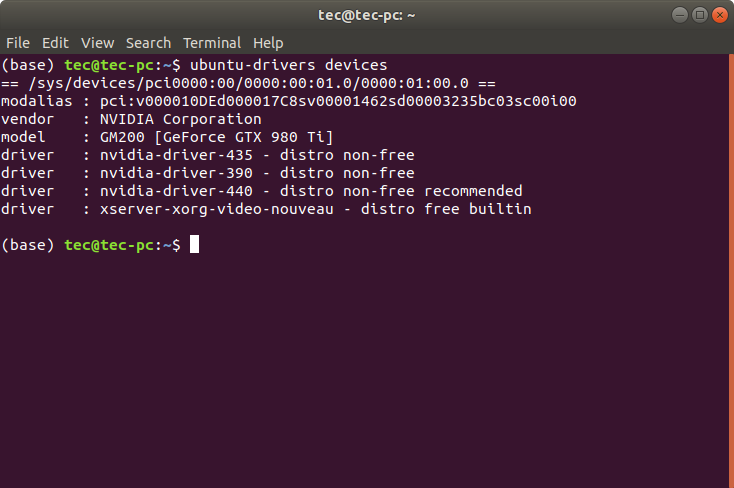
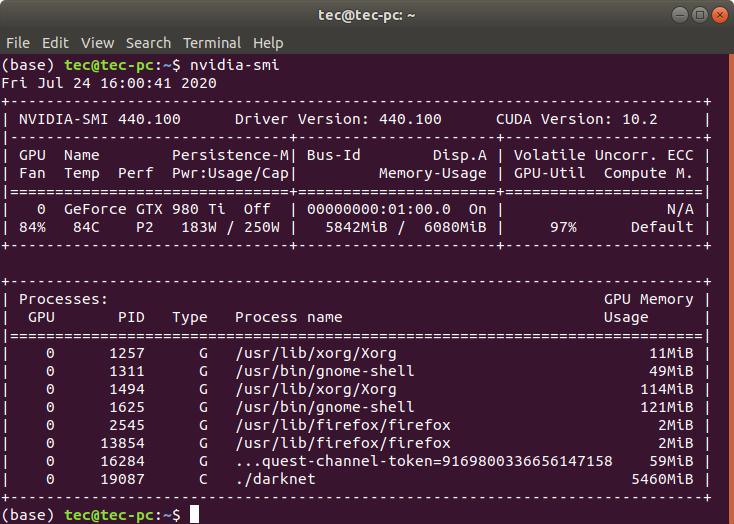
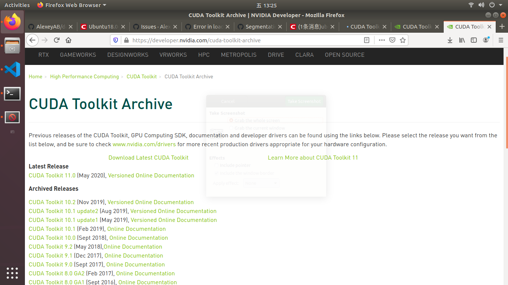
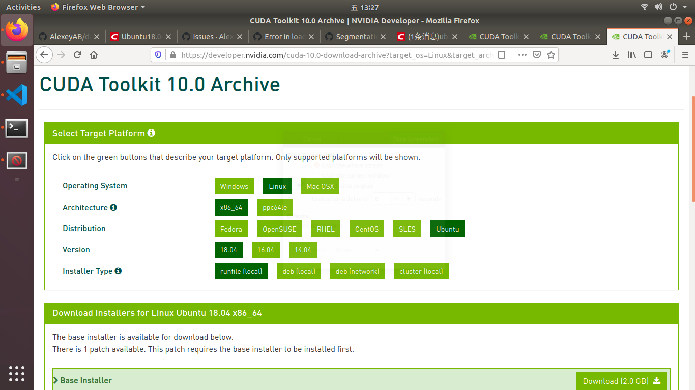
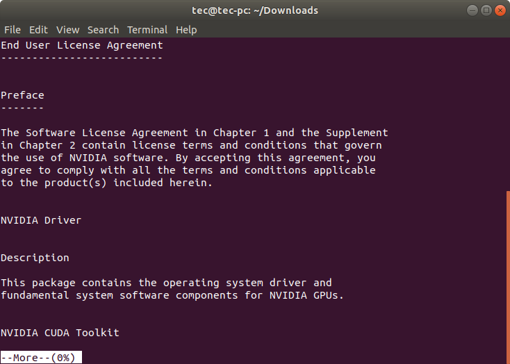
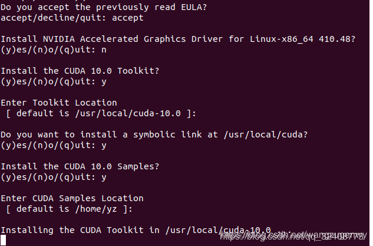
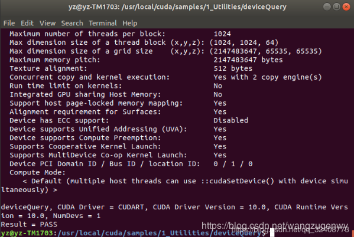

### ubuntu 18.04 install darknet + yolov4 + cuda10.0 + cudnn7.6.4 + opencv3.4.10

<!-- @import "[TOC]" {cmd="toc" depthFrom=1 depthTo=6 orderedList=false} -->

<!-- code_chunk_output -->

- [ubuntu 18.04 install darknet + yolov4 + cuda10.0 + cudnn7.6.4 + opencv3.4.10](#ubuntu-1804-install-darknet-yolov4-cuda100-cudnn764-opencv3410)
  - [Step0: Install Nvidia Driver](#step0-install-nvidia-driver)
  - [Step1: Install cuda10.0 & cudnn7.6.4](#step1-install-cuda100-cudnn764)
  - [Step2: Install CUDNN](#step2-install-cudnn)
  - [Step3: Install OpenCV](#step3-install-opencv)
  - [Step4: Compile darknet](#step4-compile-darknet)

<!-- /code_chunk_output -->


NOTE: A totally new ubuntu 18.04 system is needed, otherwise the reliable of this tutorial can not be trusted.

#### Step0: Install Nvidia Driver

1. remove old nvidia drivers, even you did not install them
`$ sudo apt-get purge nvidia*`
`$ ubuntu-drivers devices`


2. fix bad dependencies and install recommended nvidia driver
`$ sudo apt -f install`
`$ sudo apt-get install nvidia-driver-440`

3. reboot the computer and check it with `nvidia-smi`

**<font color="red">NOTE: If your computer has turned on the secure boot, remember to turn if off, then install the driver.(It is very important).</font>**

#### Step1: Install cuda10.0 & cudnn7.6.4

1. download cuda_10.0.130_410.48_linux.run file from [official website](https://developer.nvidia.com/cuda-toolkit-archive)



2. install the package (you can skip the agreement by ctrl + c)
`$ sudo sh cuda_10.0.130_410.48_linux.run`


3. **do not choose to install the nvidia accelarated graphics driver(important)**


4. add environment variable to system path
`$ sudo ~/.bashrc`

5. add these codes to last of the file
```
$ export CUDA_HOME=/usr/local/cuda 
$ export PATH=$PATH:$CUDA_HOME/bin 
$ export LD_LIBRARY_PATH=/usr/local/cuda-10.0/lib64${LD_LIBRARY_PATH:+:${LD_LIBRARY_PATH}}
```
6. activate .bashrc
`$ source ~/.bashrc`

7. test the installation of cuda
```
$ cd /usr/local/cuda/samples/1_Utilities/deviceQuery
$ sudo make
$ ./deviceQuery
```


#### Step2: Install CUDNN

download the cudnn-10.0-linux-x64-v7.6.4.38.tgz from [nvidia website](https://developer.nvidia.com/cudnn).

unzip and copy files into cuda diretory

```
$ sudo cp cuda/include/cudnn.h /usr/local/cuda/include/ 
$ sudo cp cuda/lib64/libcudnn* /usr/local/cuda/lib64/ 
$ sudo chmod a+r /usr/local/cuda/include/cudnn.h 
$ sudo chmod a+r /usr/local/cuda/lib64/libcudnn*
```

NOTE: make sure cudnn.h can be find in the cuda/include

#### Step3: Install OpenCV

1. install deps

```
$ sudo apt install  build-essential
$ sudo apt install cmake git libgtk2.0-dev pkg-config libavcodec-dev libavformat-dev libswscale-dev  
$ sudo apt install python-dev python-numpy libtbb2 libtbb-dev libjpeg-dev libpng-dev libtiff-dev libjasper-dev libdc1394-22-dev
```

2. download source file from [opencv website](https://opencv.org/releases/)

3. prepare build dir
```
$ mkdir build
$ cd build
$ cmake -D CMAKE_BUILD_TYPE=Release -D CMAKE_INSTALL_PREFIX=/usr/local ..
$ sudo make -j8
$ sudo make install
```

4. add environment variable to system path

`$ sudo gedit /etc/ld.so.conf.d/opencv.conf`

add this code to the file (maybe a black file)
`$ /usr/local/lib`

update setting
`$ sudo ldconfig `

add environment variable
```
$ vim ~/.bashrc
$ PKG_CONFIG_PATH=$PKG_CONFIG_PATH:/usr/local/lib/pkgconfig  
$ export PKG_CONFIG_PATH  
```

activate settting
`source ~/.bashrc`
`sudo updatedb`

5. test installation

```
cd ~/Downloads/opencv-3.4.10/sample/cpp/example_cmake
cmake .
make
./opencv_example
```

#### Step4: Compile darknet

1. download package from [github](https://github.com/AlexeyAB/darknet.git)

```
cd darknet
gedit Makefile
```

set GPU = 1
set CUDNN = 1
set OPENCV = 1

`make -j8`

if permission denied, then
`sudo chmod -R 777 darknet`
`make -j8`

