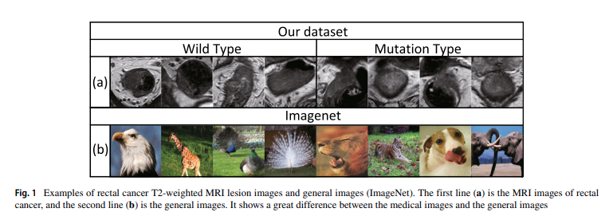
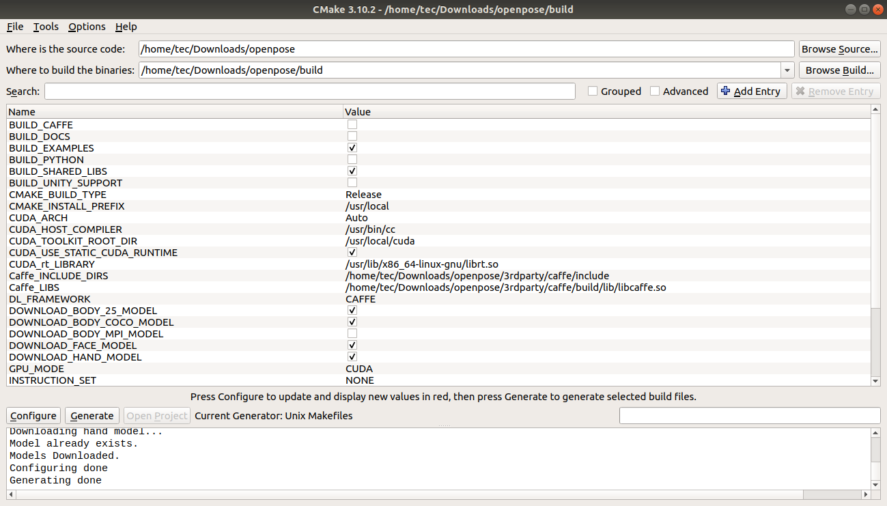
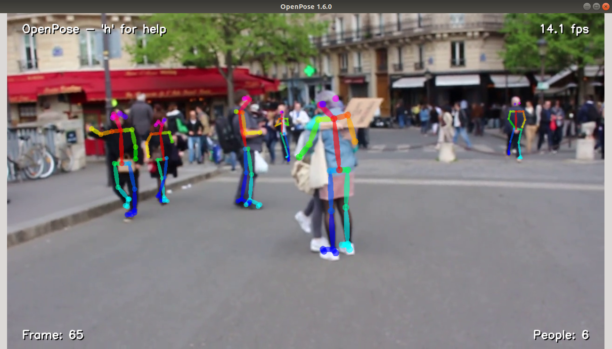

### 2020.07.25 transfer learning and openpose

<!-- @import "[TOC]" {cmd="toc" depthFrom=1 depthTo=6 orderedList=false} -->

<!-- code_chunk_output -->

- [2020.07.25 transfer learning and openpose](#20200725-transfer-learning-and-openpose)
  - [transfer learning](#transfer-learning)
  - [openpose安装(ubuntu 18.04)](#openpose安装ubuntu-1804)
    - [安装caffe](#安装caffe)
      - [1. 安装依赖](#1-安装依赖)
      - [2. 下载caffe](#2-下载caffe)
      - [3. 修改caffe配置文件](#3-修改caffe配置文件)
      - [4. 编译caffe](#4-编译caffe)
    - [安装openpose](#安装openpose)
      - [1. 下载openpose库](#1-下载openpose库)
      - [2. 安装cmake-gui](#2-安装cmake-gui)
      - [3. 下载模型权重文件](#3-下载模型权重文件)
      - [4. 配置cmake-gui](#4-配置cmake-gui)
      - [5. 编译openpose](#5-编译openpose)
      - [6. 运行样例检测人物姿态](#6-运行样例检测人物姿态)
      - [问题 cannot find #include "caffe/proto/caffe.pb.h"](#问题-cannot-find-include-caffeprotocaffepbh)
      - [问题 libcudart.so.10.0 not found](#问题-libcudartso100-not-found)

<!-- /code_chunk_output -->

#### transfer learning

迁移学习这个概念在不同的人眼里是有不同的意义的，因此可能互联网上不乏吹之贬之的人。迁移学习主要涉及两个重要的概念：
- 源域：预训练模型所使用的数据集及其权重分布
- 目标域：自己的数据集，有待实施迁移学习

迁移学习的过程即基于预训练的模型权重为基础，尽可能不改动已有权重，充分发挥其强大的特征提取能力提高当前数据集的模型性能。

考虑到上述流程，可以想到迁移学习应该使用两种方式：
- 方式1：不改变特征提取器权重，直接将其作为backbone，仅对最后几层网络（可能为分类层、分割层、检测层等）进行权重的随机初始化并训练
- 方式2：对所有的卷积层进行权重微调，这种情况一般发生在自己的数据集跟预训练数据集差异较大时使用

对于**通用图像处理领域**来讲，其图像往往具有较大的通用性，因此迁移学习往往可以发挥不错的效果；对于**医学图像处理领域**来讲，迁移学习的作用一般来讲是不总是有效的，因为首先医学图像是灰度图像，其次医学图象的数据规模一般比较小，源域的自然图像与目标域的医学图像存在距离相差过大的问题，不利于迁移学习的进行（为什么这么讲呢？因为深度学习本质上是一个特征提取问题，预训练的特征提取器权重在这个领域可能被破坏的比较彻底）。



如上图所述，对于通用图像来讲，其数据往往是人类肉眼就可以分清楚其物体的，而医学数据集则不同，第一行的数据即使是医师也完全无法区分，需要借助外部工具才可以，这种情况下显然迁移学习是收效甚微的，即**只要你的数据集是肉眼可分的，那么迁移学习应该是要比从零开始训练要更优的**。

#### openpose安装(ubuntu 18.04)

**NOTE1: 有一个值得注意的问题，编译caffe之前最好卸载掉anaconda，否则编译可能会失败。
NOTE2: 整个流程能够顺利完成最关键的就是caffe的编译工作，如果这个教程不能编译顺利编译caffe，可以去寻找比较完整的caffe编译教程帮你顺利完成任务。**

```
CMake Error: The following variables are used in this project, but they are set to NOTFOUND.
Please set them or make sure they are set and tested correctly in the CMake files:
CUDA_cublas_device_LIBRARY (ADVANCED)

移除anaconda后问题解决
```

##### 安装caffe

###### 1. 安装依赖

```
sudo apt-get install git
sudo apt-get install libprotobuf-dev libleveldb-dev libsnappy-dev libopencv-dev
libhdf5-serial-dev protobuf-compiler
sudo apt-get install --no-install-recommends libboost-all-dev
sudo apt-get install libatlas-base-dev
sudo apt-get install python-dev
sudo apt-get install libgflags-dev libgoogle-glog-dev liblmdb-dev
```

###### 2. 下载caffe

建议下载openpose里的[caffe](https://github.com/CMU-Perceptual-Computing-Lab/caffe)，直接下载原版caffe会报不支持的错误。

```
Error parsing text-format caffe.NetParameter: 3707:25: Message type "caffe.LayerParameter" has no field named "psroi_pooling_param".

这个问题的出现是因为安装了原版的caffe，解决方案：
1. 重新下载openpose的caffe进行编译
2. 更改cmake里的caffe_include_path等变量
3. 重新编译openpose
```

###### 3. 修改caffe配置文件

修改Makefile.config(该文件可以复制已有的文件并更名即可)

```
USE_CUDNN := 1

OPENCV_VERSION := 3

CUDA_DIR := /usr/local/cuda-10.0

CUDA_ARCH :=    \
                -gencode arch=compute_30,code=sm_30 \
                -gencode arch=compute_35,code=sm_35 \
                -gencode arch=compute_50,code=sm_50 \
                -gencode arch=compute_52,code=sm_52 \
                -gencode arch=compute_60,code=sm_60 \
                -gencode arch=compute_61,code=sm_61 \
                -gencode arch=compute_61,code=compute_61

WITH_PYTHON_LAYER := 1

# 修改前：
INCLUDE_DIRS := $(PYTHON_INCLUDE) /usr/local/include
LIBRARY_DIRS := $(PYTHON_LIB) /usr/local/lib /usr/lib 
# 修改后：
INCLUDE_DIRS := $(PYTHON_INCLUDE) /usr/local/include /usr/include/hdf5/serial/
LIBRARY_DIRS := $(PYTHON_LIB) /usr/local/lib /usr/lib /usr/lib/x86_64-linux-gnu /usr/lib/x86_64-linux-gnu/hdf5/serial

#修改前:
LIBRARIES += glog gflags protobuf boost_system boost_filesystem m hdf5_hl hdf5
#修改后：
LIBRARIES += glog gflags protobuf boost_system boost_filesystem m hdf5_serial_hl hdf5_serial 

# 修改前：
NVCCFLAGS += -ccbin=$(CXX) -Xcompiler -fPIC $(COMMON_FLAGS)
# 修改后：
NVCCFLAGS += -D_FORCE_INLINES -ccbin=$(CXX) -Xcompiler -fPIC $(COMMON_FLAGS)

```

网上有说还要修改Makefile文件，我这边没有进行修改但是也编译成功了，如果遇到问题可以尝试修改此处

```
将：
NVCCFLAGS +=-ccbin=$(CXX) -Xcompiler-fPIC $(COMMON_FLAGS)
替换为：
NVCCFLAGS += -D_FORCE_INLINES -ccbin=$(CXX) -Xcompiler -fPIC $(COMMON_FLAGS)
 
将：
LIBRARIES += glog gflags protobuf boost_system boost_filesystem m hdf5_hl hdf5
改为：
LIBRARIES += glog gflags protobuf boost_system boost_filesystem m hdf5_serial_hl hdf5_serial
```

###### 4. 编译caffe

```
cd caffe
make clean
make -j8
```

##### 安装openpose

###### 1. 下载openpose库

建议从官网CMU的github下载[库文件](https://github.com/CMU-Perceptual-Computing-Lab/openpose.git)

###### 2. 安装cmake-gui

这个工具还挺好用的～

`sudo apt-get install cmake-gui`

###### 3. 下载模型权重文件

``` 
cd openpose
cd models
./getModels.sh
```

###### 4. 配置cmake-gui

1. 填写src和dst目录
2. 点击Configure按钮, 选择Unix Makefile和use default native compling，点击finish按钮 
3. 取消build caffe勾选
4. 填写之前编译好的caffe_libs, caffe_include_dirs(不知道文件在哪里可以用文件管理器搜索一下文件路径)
5. 点击Generate



###### 5. 编译openpose

```
cd build/
sudo make
```

###### 6. 运行样例检测人物姿态

`./build/examples/openpose/openpose.bin --video examples/media/video.avi`



###### 问题 cannot find #include "caffe/proto/caffe.pb.h"

解决方案：

```
protoc src/caffe/proto/caffe.proto --cpp_out=.
mkdir include/caffe/proto
mv src/caffe/proto/caffe.pb.h include/caffe/proto
```

###### 问题 libcudart.so.10.0 not found

```
/usr/bin/ld: warning: libcudart.so.10.0, needed by ../../../3rdparty/caffe/build/lib/libcaffe.so, not found (try using -rpath or -rpath-link)
/usr/bin/ld: warning: libcublas.so.10.0, needed by ../../../3rdparty/caffe/build/lib/libcaffe.so, not found (try using -rpath or -rpath-link)
/usr/bin/ld: warning: libcurand.so.10.0, needed by ../../../3rdparty/caffe/build/lib/libcaffe.so, not found (try using -rpath or -rpath-link)
```

解决方案：

```
sudo cp /usr/local/cuda-10.0/lib64/libcudart.so.10.0 /usr/local/lib/libcudart.so.10.0 && sudo ldconfig
sudo cp /usr/local/cuda-10.0/lib64/libcublas.so.10.0 /usr/local/lib/libcublas.so.10.0 && sudo ldconfig
sudo cp /usr/local/cuda-10.0/lib64/libcurand.so.10.0 /usr/local/lib/libcurand.so.10.0 && sudo ldconfig
```