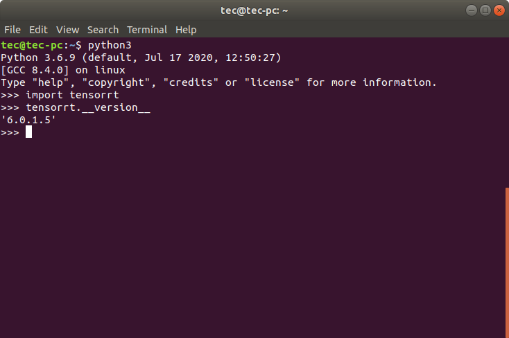

<!-- @import "[TOC]" {cmd="toc" depthFrom=1 depthTo=6 orderedList=false} -->

<!-- code_chunk_output -->

- [Tensorrt](#tensorrt)
  - [简介](#简介)
  - [安装](#安装)
  - [1. 下载压缩文件](#1-下载压缩文件)
  - [2. 配置环境变量](#2-配置环境变量)
  - [3. 安装pytensorrt](#3-安装pytensorrt)
- [Tiny-tensorrt](#tiny-tensorrt)
  - [1. 下载项目到本地](#1-下载项目到本地)
  - [2. 修改配置文件](#2-修改配置文件)
  - [3. 编译](#3-编译)
  - [4. 使用(详见项目doc)](#4-使用详见项目doc)
  - [5. 遇到的问题](#5-遇到的问题)
    - [CUDA error 48](#cuda-error-48)

<!-- /code_chunk_output -->

### Tensorrt

#### 简介

Tensorrt是用来加速训练完成的神经网络的一个加速工具，主要加速方案有两种
- 通过改变模型参数的数据类型(FP32 --> FP16 || FP32 --> INT16)
- 通过层间融合或张量融合(在指定模型的输入输出层后尽可能合并不同层之间的计算过程)

#### 安装

写本文档时使用tensorrt的原因是因为openpose在嵌入式端的运行速度需要400ms以上，不能够满足一线的生产需要，因此尝试使用tensorrt对openpose内置的caffe模型进行加速。

对于简单的需要对caffe模型进行加速的话，只需要正常从nvidia官网下载并安装即可。

安装流程如下：

#### 1. 下载压缩文件

对于x86架构的linux系统，直接下载[TensorRT-6.0.1.5.Ubuntu-18.04.x86_64-gnu.cuda-10.0.cudnn7.6.tar.gz](https://developer.nvidia.com/compute/machine-learning/tensorrt/secure/6.0/GA_6.0.1.5/tars/TensorRT-6.0.1.5.Ubuntu-18.04.x86_64-gnu.cuda-10.0.cudnn7.6.tar.gz)并解压缩到本地。关于版本问题，因为我只找到了基于tensort >= 6.0版本的prelu(openpose要用)实现，因此选择安装本版本，对于没有此需求的开发者直接可以根据自己需求进行安装。

对于arm架构的linux系统，如jetpack，需要使用jetpack sdkmanager进行刷机安装。

#### 2. 配置环境变量

```
$ vim ~/.bashrc # 打开环境变量文件

export LD_LIBRARY_PATH=TensorRT解压路径/lib:$LD_LIBRARY_PATH
export CUDA_INSTALL_DIR=/usr/local/cuda-9.0
export CUDNN_INSTALL_DIR=/usr/local/cuda-9.0

$ source ~/.bashrc
```

#### 3. 安装pytensorrt

进入tensorrt的python目录，使用pip安装符合自己版本的whl文件即可正常使用python api



### Tiny-tensorrt

官方的tensorrt里其实是有prelu的实现的`NvInferPlugin::createLReLUPlugin`，但是我琢磨了一段时间不知道如何调用(菜鸡石锤)，因此在github上发现了[tiny-tensort](https://github.com/zerollzeng/tiny-tensorrt)中对于prelu的实现，并且该作者提供了[tensorrt-zoo](https://github.com/zerollzeng/tensorrt-zoo)，该项目实现了tensorrt对于openpose的解析和兼容(非常的符合需求呢)。

#### 1. 下载项目到本地

```
git clone --recursive https://github.com/zerollzeng/tensorrt-zoo.git
```

#### 2. 修改配置文件

考虑到tensorrt仅仅是配置了lib的环境变量，因此CMakeLists.txt文件里需要引入tensorrt的头文件

```
include_directories(/home/tec/Downloads/tensorrt/TensorRT-6.0.1.5/include)
link_directories(/home/tec/Downloads/tensorrt/TensorRT-6.0.1.5/lib)
find_library(CUDART cudart HINTS /usr/local/cuda/lib64)
```

#### 3. 编译

```
mkdir build
cd build
cmake ..
make -j8
```

#### 4. 使用(详见项目doc)

#### 5. 遇到的问题

##### CUDA error 48

项目可以正常运行，引擎也可以正常编译，但是前向传播的时候会报这个错误。

CUDA error 48 at /home/nvidia/Downloads/tensorrt-zoo/tiny-tensorrt/plugin/PReLUPlugin/PReLUPlugin.cu:177

项目作者给出了一些可能的方案，但都没有生效，可能还是我的操作有些问题

- the reason why you can not compile this on jetson is because jeston does not support fp16, try comment fp16 relation part in `preluplugin.h` and `preluplugin.cu`
- 让PRluPlugin 通过 cpu 运算，可以参考[link-url](https://github.com/zerollzeng/tiny-tensorrt/blob/master/plugin/YoloLayerPlugin/YoloLayerPlugin.cu)