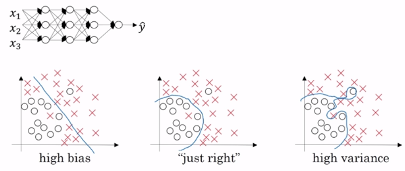
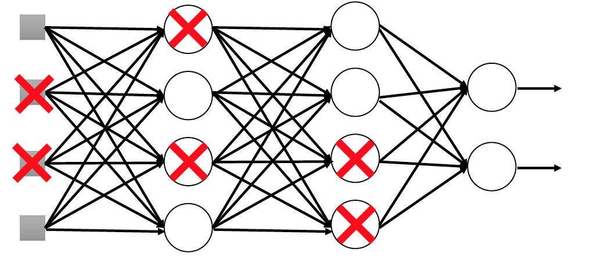
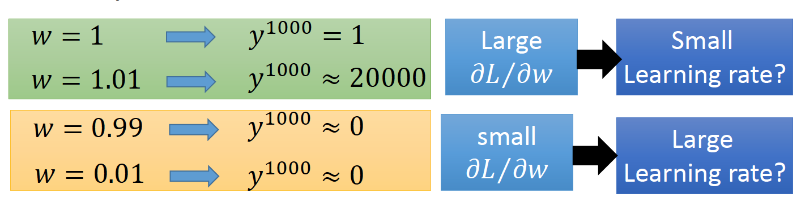
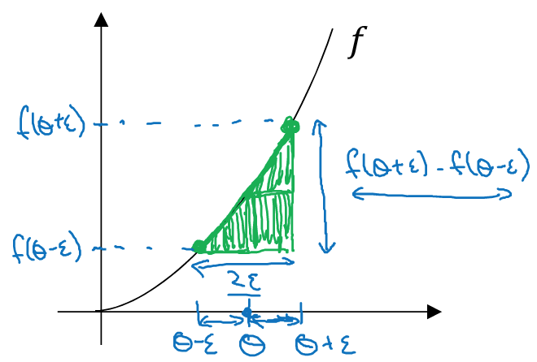

<!-- ---
presentation:
  width: 1500
  height: 700
  center: true
  progress: true
--- -->

<!-- @import "[TOC]" {cmd="toc" depthFrom=1 depthTo=6 orderedList=false} -->

<!-- code_chunk_output -->

* [1. 训练/验证/测试集](#1-训练验证测试集)
* [2. 偏差/方差](#2-偏差方差)
* [3. 正则化](#3-正则化)
	* [3.1. 为什么要使用正则化](#31-为什么要使用正则化)
	* [3.2 L1正则化与L2正则化](#32-l1正则化与l2正则化)
	* [3.3. 为什么正则化可以减少过拟合](#33-为什么正则化可以减少过拟合)
* [4. Dropout](#4-dropout)
* [5. 其他正则化方法](#5-其他正则化方法)
* [6. 正则化输入](#6-正则化输入)
* [7. 梯度消失与梯度爆炸](#7-梯度消失与梯度爆炸)
* [8. 神经网络权重初始化](#8-神经网络权重初始化)
* [9. 梯度的数值逼近](#9-梯度的数值逼近)
* [10. 梯度检验](#10-梯度检验)

<!-- /code_chunk_output -->

## 1. 训练/验证/测试集

- 训练集用来训练模型，开发集用来做交叉验证，选择最好的超参数,测试集提供对模型效果的无偏估计

- 注意: 
	
	- 很多时候我们会遇到训练集和开发集、测试集的数据来自不同的分布，一个通常的经验是保证开发集和测试集的数据来自**同一分布**即可。

	- **训练集与测试集分布不同怎么办?**

		> 现实工程实践中，有时候训练集和另外两种允许来自不同的分布，**通俗的说，就是产生的数据方式不同**，但是另外两种数据集，即开发集与测试集必须保持是同分布。[[链接](https://www.jianshu.com/p/815618a082a7)]

		即假定你有个识别人脸的应用，你的数据集是来自某知名人脸数据库（简称原数据库），10万张左右，图片清晰标注明确。而你的用户是手机上传图像，图像模糊且场景较复杂，1万张左右。那么我们就可以认为我们的训练集与验证集及测试集是不同分布的，因为其产生数据的方式显然是不同的。[[链接](http://www.mooc.ai/group/0/thread/1644?type=all&sort=desc)]

		对于上述的训练集与验证集/测试集分布不同步的问题应该如何处理？[[解决措施](https://blog.csdn.net/juranyaoyingwen/article/details/80597994)]
		- 方法1：将两种数据直接混合打乱，按照既定的分类方式分成训练集/验证集/测试集
		- 方法2(推荐)：从1万张用户上传的图像中取出5000张放入训练集，剩下的用于验证集/测试集

	- 如果不需要对模型进行无偏估计，那么可以不需要测试集，只通过开发集验证效果即可[[如何理解无偏估计与有偏估计](https://blog.csdn.net/ccnt_2012/article/details/82715415)]


## 2. 偏差/方差

高偏差意味着欠拟合(训练集与测试集错误率均很高)

高方差意味着过拟合(训练集错误率低但是测试集错误率很高)

|result|high variance|high bias|high variance & high bias|low variance & low bias|
|---|---|---|---|---|
|Train set error|1%|15%|15%|0.5%|
|Test set error|11%|16%|30%|1%|


## 3. 正则化

<div style="text-align: center">
  
</div>

### 3.1. 为什么要使用正则化
 
- 当感觉模型的方差比较大(过拟合)的时候，一个通常的做法是加入正则化。正则性衡量了函数光滑的程度，**正则性越高，函数越光滑**(光滑衡量了函数的可导性，如果一个函数是光滑函数，则该函数无穷可导，即任意n阶可导)。

- 为目标函数添加正则项，则最终的函数为$$J(w, b) = \frac{1}{m}\sum_{i=1}^mL(y^{(i)}, \hat{y}^{(i)}) + \frac{\lambda}{2m}\left\|w\right\|_2^2$$其中：
$w$为神经网络的权重
$b$为该层神经网络的偏置，为根据权重而附加在激活函数上的常数项
$\lambda$为正则项的系数，$\lambda > 0$
$m$为样本数

### 3.2 L1正则化与L2正则化

- L1正则化是指权值向量$w$中各个元素的绝对值之和，通常表示为$\left\|w\right\|_1$。**L1正则通常会导致模型稀疏** [[为什么L1会导致稀疏](https://blog.csdn.net/jinping_shi/article/details/52433975)]

- L2正则化是指权值向量$w$中各个元素的平方和然后再求平方根（可以看到**Ridge回归**的L2正则化项有平方符号,因此其正则化的系数一般有一个$\frac{1}{2}$为了简化求导运算），通常表示为$\left\|w\right\|_2^2$

<div style="text-align: center">
  
  <span style="display:inline-block; width: 50%">图左：1范数等值线图</span><span style="display:inline-block; width: 50%">图右：2范数等值线图</span>
</div>
</br>

- 1范数正则化称为Lasso回归，2范数正则化称为岭回归。可以看出，1范数等值线图与平方误差项等值线的交点常出现在坐标轴上，而2范数等值线图与其的交点通常出现在某个象限内

- L1会趋向于产生少量的特征，而其他的特征都是0，而L2会选择更多的特征，这些特征都会接近于0。Lasso在特征选择时候非常有用，而Ridge就只是一种规则化而已。在所有特征中只有少数特征起重要作用的情况下，选择Lasso比较合适，因为它能自动选择特征。而如果所有特征中，大部分特征都能起作用，而且起的作用很平均，那么使用Ridge也许更合适。[[链接](https://www.jianshu.com/p/475d2c3197d2)]


### 3.3. 为什么正则化可以减少过拟合

- 第一个角度是随着代价函数中参数lambda的增大，模型权重参数趋近为0。这意味着网络中绝大多数隐层单元被抑制，整个网络趋近于一个线性模型，网络复杂性降低带来模型方差降低，但相应的模型的偏差会增大。

- 第二个角度是正则项导致参数取值较小，带来激活函数的输入也相应的变小。对于sigmoid和tanh函数来说，**当输入值在0附近波动时，激活函数的输出是接近线性的**。如果所有的隐层单元输出都是接近线性，那么模型的方差也会降低。

## 4. Dropout

- dropout指的是在训练网络时，针对每个训练样本，**随机让某些隐层单元失活(置零)**，这样训练每条样本的网络是原先网络的一个简单的子网络。这样做的好处是降低了网络的复杂度，减少训练结果的方差。

- 原理: 遍历神经网络的每一层，设置消除神经网络中节点的概率。**即每个节点都会被设置好随机置零的概率**。目标是得到节点更少，规模更小的网络。

<div style="text-align: center">
  
</div>

- 现在流行的dropout实现方式是**Inverted dropout**。指的是每个隐层的激活函数输出值除以该层失活单元的概率，保证下一层输出结果的期望不变

- 在测试阶段不必使用dropout，保证keep_prob为1.0即可

- dropout使每个样本在训练时都随机删除一些网络节点，保证网络简单性

- dropout的存在使每个隐层单元的上一层输入都随时可能消失，这样**该隐层单元不会将所有的权重压在单一的上层单元上面**。这个机制有利于网络权重的分散，降低L2范数。

- **网络不同层的keep_prob概率(keep probability，神经元保留概率)可以不同**，参数矩阵过大的层可以使用较低的keep_prob，**过拟合风险较小的层**可以使用较大的keep_prob

  ``` python
  L3_drop = tf.nn.dropout(L3, keep_prob)
  sess.run(train_step, feed_dict={x: xa, y: ys, keep_prob: 0.7})
  ```
  
- dropout的缺陷在于代价函数无法被明确定义。

## 5. 其他正则化方法

- Fake Data：将有限的图片翻转、平移、裁剪，构造更大的训练集。

- early stopping：优势在于运行一次梯度下降即可获取相对低的偏差和方差的模型；劣势在于混淆了优化代价函数和减小方差两个任务，视频中认为**正交化**更值的信赖，但是需要大量计算。

## 6. 正则化输入

- 零均值化
- 归一化方差
- 训练集和测试集都要进行**相同的正则化**，即使用相同的均值和方差来正则化训练集和测试集。
- 未进行正则化的数据进行梯度下降时需要迭代很多轮才能收敛。正则化的数据在梯度下降时达到收敛需要的迭代轮数少了很多。

## 7. 梯度消失与梯度爆炸

- 当层数足够深时，如果参数值大于1，会出现梯度爆炸现象；如果参数值小于1，会出现梯度消失现象。
[[梯度消失梯度爆炸极其解决方案](https://blog.csdn.net/qq_25737169/article/details/78847691)]
<div style="text-align: center">
  
</div>


## 8. 神经网络权重初始化

神经网络参数的初始化通常是按照高斯分布随机取值之后乘一个因子，这个因子有几种不同的取值。

- 如果激活函数是Relu，那么权重初始化公式为$$w^{[l]} = w^{[l]} * \sqrt{\frac{2}{n^{l-1}}}$$

- 如果激活函数是tanh，那么权重初始化公式为$$w^{[l]} = w^{[l]} * \sqrt{\frac{1}{n^{l-1}}}$$

- 其他方法$$w^{[l]} = w^{[l]} * \sqrt{\frac{1}{n^{l-1}}}$$

## 9. 梯度的数值逼近

<div style="text-align: center">
  
</div>

双边公差公式(导数定义)：$$f'(\theta) = \lim_{\epsilon\to0}\frac{f(\theta+\epsilon)-f(\theta-\epsilon)}{2\epsilon}$$

单边公差公式：$$f'(\theta) = \lim_{\epsilon\to0}\frac{f(\theta+\epsilon)-f(\theta)}{\epsilon}$$

## 10. 梯度检验

检查梯度计算是否正确，可以采用梯度逼近的数学技巧。

- 首先将所有参数合并为一个大向量，将所有参数的梯度值也合并为一个大向量

- 接下来对每个参数计算梯度逼近值，再计算该值与真实梯度值之间的距离。

- 注意： 

  梯度检验只在debug中使用，不要在训练中使用。
  如果梯度检验失败了，检查所有项以发现bug究竟是在哪一个阶段出现的。
  如果使用了正则项，那么求梯度的时候不要忘记它。
  梯度检验不能和dropout同时使用。