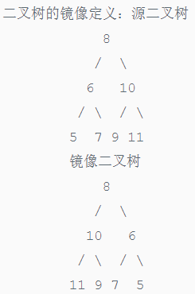

<!-- @import "[TOC]" {cmd="toc" depthFrom=1 depthTo=6 orderedList=false} -->

<!-- code_chunk_output -->

- [二叉树遍历](#二叉树遍历)
  - [二叉树的深度](#二叉树的深度)
  - [从上往下打印二叉树](#从上往下打印二叉树)
  - [把二叉树打印成多行](#把二叉树打印成多行)
  - [按之字形顺序打印二叉树](#按之字形顺序打印二叉树)
  - [二叉树的下一个节点](#二叉树的下一个节点)
  - [二叉搜索树的第k个节点](#二叉搜索树的第k个节点)
  - [二叉搜索树的后序遍历序列](#二叉搜索树的后序遍历序列)
  - [二叉搜索树与双向链表](#二叉搜索树与双向链表)
  - [二叉树中和为某一值的路径](#二叉树中和为某一值的路径)
  - [二叉树的镜像](#二叉树的镜像)
  - [平衡二叉树](#平衡二叉树)
  - [对称的二叉树](#对称的二叉树)
- [二叉树重建](#二叉树重建)
  - [树的子结构](#树的子结构)
  - [重建二叉树](#重建二叉树)
  - [序列化二叉树](#序列化二叉树)

<!-- /code_chunk_output -->

#### 二叉树遍历

##### 二叉树的深度

二叉树的深度即左右字数的最大深度，考虑递归每次求解左右子树最大值就好了。

```python
class Solution:
    def TreeDepth(self, pRoot):
        # write code here
        def dfs(pRoot, cnt):
            if pRoot == None:
                return cnt
            return max(dfs(pRoot.left, cnt+1), dfs(pRoot.right, cnt+1))
        return dfs(pRoot, 0)
```


##### 从上往下打印二叉树

与前序、中序及后序遍历二叉树不同，层序遍历二叉树一般需要借助BFS实现，前者一般借助DFS实现。

```python
class Solution:
    # 返回从上到下每个节点值列表，例：[1,2,3]
    def PrintFromTopToBottom(self, root):
        # write code here
        if root is None:
            return []
        
        res = []
        queue = [root]
        while queue:
            node = queue.pop(0)
            res.append(node.val)
            if node.left:
                queue.append(node.left)
            if node.right:
                queue.append(node.right)
        return res                
```

##### 把二叉树打印成多行

同样是用BFS实现，只是需要确定当前层的节点数

```python
class Solution:
    # 返回二维列表[[1,2],[4,5]]
    def Print(self, pRoot):
        # write code here
        # 不能用栈实现，应该用队列保证先进先出的顺序才可以
        queue = [pRoot]
        res = []
        while len(queue) != 0:
            size = len(queue)    # 确定好当前行需要出栈几个节点
            row = []
            for i in range(size):
                node = queue.pop(0)
                if node != None:
                    row.append(node.val)
                    queue.append(node.left)
                    queue.append(node.right)
            if row:
                res.append(row)
        return res
```

##### 按之字形顺序打印二叉树

跟按层打印二叉树的思路是一致的，只不过之字形需要一层正序一层反序，需要判断一下当前的层数。两个Print表示有两种实现方案，第二种实现方案为上一题的稍加改进。

方案一
```python
class Solution:
    def Print(self, pRoot):

        if pRoot == None:
            return []

        # write code here
        cur_level = [pRoot]
        next_level = []
        is_odd = True
        res = []
        layer_res = []
        while cur_level:

            node = cur_level.pop(0)
            layer_res.append(node.val)
            # print(is_odd, res, node.val, node.left, node.right)

            if node.left:
                next_level.append(node.left)
            if node.right:
                next_level.append(node.right)

            if len(cur_level) == 0:
                # print("change odd, ============================")
                if not is_odd:
                    layer_res.reverse()
                res.append(layer_res)
                cur_level = next_level
                next_level = []
                layer_res = []

                is_odd = not is_odd

        return res
```

方案二
```python
class Solution:
    def Print2(self, pRoot):
        # write code here
        # 不能用栈实现，应该用队列保证先进先出的顺序才可以
        queue = [pRoot]
        res = []
        odd = True
        while len(queue) != 0:
            size = len(queue)    # 确定好当前行需要出栈几个节点
            row = []
            for i in range(size):
                node = queue.pop(0)
                if node != None:
                    row.append(node.val)
                    queue.append(node.left)
                    queue.append(node.right)
            if row:
                if odd:
                    res.append(row)
                else:
                    row.reverse()
                    res.append(row)
            odd = not odd
        return res
```

##### 二叉树的下一个节点

本题的思路在于列举出下一个节点的几种情况
1. 如果是空树 --- 直接返回None
2. 当前节点有右子节点
    - 右子节点没有左节点 --- 右子节点为下一个节点
    - 右子节点有左节点 --- 右子节点的最下边的左子节点
3. 当前节点没有右子节点
    - 自己是父节点的左孩子 --- 当前节点的父亲节点为下一个节点
    - 自己是父节点的右孩子 --- 直到当前节点的父节点是左子树的时候
4. 当前节点为中序遍历的最后一个节点 --- 返回None
```python
# -*- coding:utf-8 -*-
# class TreeLinkNode:
#     def __init__(self, x):
#         self.val = x
#         self.left = None
#         self.right = None
#         self.next = None
class Solution:
    def GetNext(self, pNode):
        # write code here
        
        # 1. 空树
        if pNode == None:
            return pNode
        
        # 2. pNode有右节点
        if pNode.right:
            pNode = pNode.right
            while pNode.left:
                pNode = pNode.left
            return pNode
            
        # 3. pNode没有右节点
        while pNode.next:
            father = pNode.next
            if pNode == father.left:
                return father
            pNode = pNode.next
        
        # 4. 么有下一个节点存在
        return None            
```

##### 二叉搜索树的第k个节点

相当于指定了中序遍历的迭代长度了吧

```python
# -*- coding:utf-8 -*-
class Solution:
    def KthNode(self, pRoot, k):
        # write code here
        stack = []
        while pRoot:
            stack.append(pRoot)
            pRoot = pRoot.left
         
        res = []
        while stack:
            node = stack.pop()
            res.append(node)
             
            if len(res) == k:
                return res[-1]
             
            if node.right:
                stack.append(node.right)
                temp = node.right
                while temp.left:
                    stack.append(temp.left)
                    temp = temp.left
```

##### 二叉搜索树的后序遍历序列

> 输入一个整数数组，判断该数组是不是某二叉搜索树的后序遍历的结果。如果是则输出Yes,否则输出No。假设输入的数组的任意两个数字都互不相同。
> Input: [4,8,6,12,16,14,10]
> Output: True

**思路**: 二叉搜索树的后序遍历的特点在于**序列的最后一个值为二叉搜索树的根，且根据根的值的大小可以把划分出二叉搜索树的左右子树**（左子树所有值小于根，右子树所有值大于根），然后考虑利用递归进行判断即可。可以假设该序列是二叉搜索树的后序遍历，如果没有办法顺利的递归到空序列，就不是后序遍历序列，返回False。

```python
# -*- coding:utf-8 -*-
class Solution:
    def VerifySquenceOfBST(self, sequence):
        # write code here
        def dfs(sequence):
            
            if not sequence:
                return
            
            root = sequence.pop()
            split_index = 0
            while split_index < len(sequence) and sequence[split_index] < root:
                split_index += 1
            right = sequence[split_index:]
            for val in right:
                if val < root:
                    return False
            dfs(sequence[:split_index])
            dfs(right)
            return True
            
        return dfs(sequence)
```

##### 二叉搜索树与双向链表

> 输入一棵二叉搜索树，将该二叉搜索树转换成一个排序的双向链表。要求不能创建任何新的结点，只能调整树中结点指针的指向。
> Input: {10,6,14,4,8,12,16}
> Output: From left to right are:4,6,8,10,12,14,16;From right to left are:16,14,12,10,8,6,4;

**思路**: 在中序遍历的基础上反转链表

```python
# -*- coding:utf-8 -*-
class Solution:
    def Convert(self, pRootOfTree):
        # write code here

        # 先写中序遍历，用栈记录左指针顺序
        if pRootOfTree == None:
            return pRootOfTree
        
        stack = []        
        while pRootOfTree:
            stack.append(pRootOfTree)
            pRootOfTree = pRootOfTree.left

        # node的左节点应该给前置节点
        # node的右节点应该给中序遍历的下一个节点
        # 节点的变更不应该影响正常的中序遍历流程
        is_first = True
        while stack:
            node = stack.pop()
            # 对于第一个节点要做特殊处理
            if is_first: 
                head = node
                pre = head
                node.left = None
                is_first = False
            else:
                node.left = pre
                pre.right = node
                pre = node
            
            if node.right:
                stack.append(node.right)
                temp = node.right
                while temp.left:
                    stack.append(temp.left)
                    temp = temp.left
         
        return head
```

##### 二叉树中和为某一值的路径

> 输入一颗二叉树的根节点和一个整数，按字典序打印出二叉树中结点值的和为输入整数的所有路径。路径定义为从树的根结点开始往下一直到叶结点所经过的结点形成一条路径。
> Input: {10,5,12,4,7},22
> Output: \[\[10,5,7], \[10,12]]

```python
# -*- coding:utf-8 -*-
class Solution:
    # 返回二维列表，内部每个列表表示找到的路径
    def FindPath(self, root, expectNumber):
        # write code here
        def dfs(root, target, path, res):

            if root == None:
                return
            if root != None:
                path.append(root.val)
            
            if root.val == target and root.left == None and root.right == None:
                res.append(path[:])
            
            dfs(root.left, target-root.val, path[:], res)
            dfs(root.right, target-root.val, path[:], res)
            return res
        
        if root == None:
            return []
            
        res = dfs(root, expectNumber, [], [])
        return res
```

##### 二叉树的镜像

> 操作给定的二叉树，将其变换为源二叉树的镜像。


思路：利用递归逐层交换左右节点即可

```python
# -*- coding:utf-8 -*-
class Solution:
    # 返回镜像树的根节点
    def Mirror(self, root):
        # write code here
        def dfs(root):             
            if root == None:
                return -1
            
            # 交换左右节点
            temp = root.left
            root.left = root.right
            root.right = temp
            
            dfs(root.left)
            dfs(root.right)
            
            return root

        return dfs(root)
```

##### 平衡二叉树

> 输入一棵二叉树，判断该二叉树是否是平衡二叉树。
> 在这里，我们只需要考虑其平衡性，不需要考虑其是不是排序二叉树

判断左右字数的深度，如果两棵树的深度小于1则为平衡二叉树，否则则不是

```python
class Solution:
    def IsBalanced_Solution(self, pRoot):
        # write code here
        def get_length(root, length=0):
            if root == None:
                return length
            length += 1
            
            left_length = get_length(root.left, length)
            right_length = get_length(root.right, length)
            
            if left_length >= right_length:
                return left_length
            else:
                return right_length
            
        if pRoot == None:
            return True
        else:
            diff = get_length(pRoot.left) - get_length(pRoot.right)
            if abs(diff) <= 1:
                return True
            else:
                return False
```

##### 对称的二叉树

> 请实现一个函数，用来判断一棵二叉树是不是对称的。注意，如果一个二叉树同此二叉树的镜像是同样的，定义其为对称的。

```python
class Solution:
    def isSymmetrical(self, pRoot):
        # write code here
        def is_sym(root1, root2):
            if root1 == None and root2 == None:
                return True
            # 如果两个根节点只有一个不为空，一个为空，肯定不对称
            elif root1 == None or root2 == None:
                return False
            
            if root1.val != root2.val:
                return False
            else:
                return is_sym(root1.right, root2.left) and \
                        is_sym(root1.left, root2.right)
                 
        return pRoot == None or is_sym(pRoot.left, pRoot.right)
```

#### 二叉树重建

##### 树的子结构
##### 重建二叉树
##### 序列化二叉树