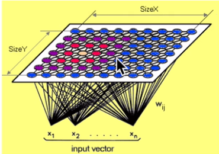
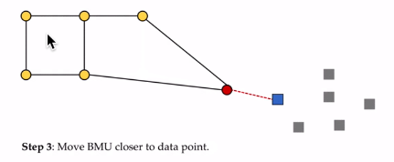
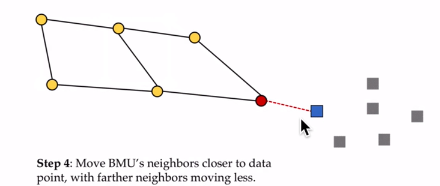
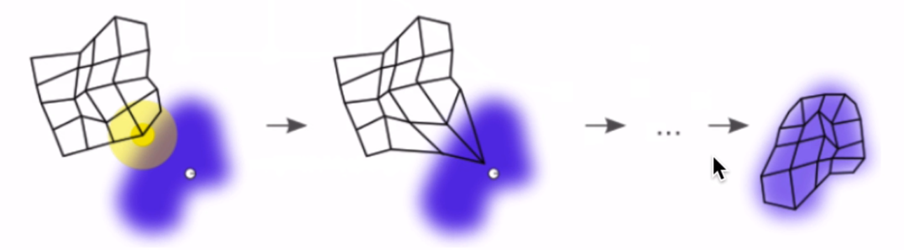
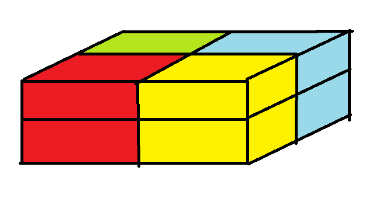
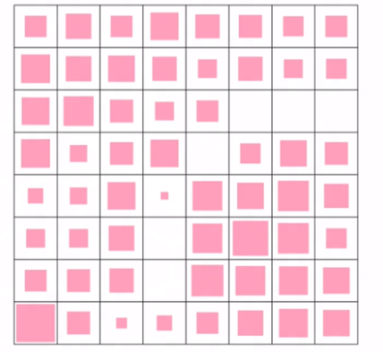

##基于模型的聚类算法


<!-- @import "[TOC]" {cmd="toc" depthFrom=1 depthTo=6 orderedList=false} -->

<!-- code_chunk_output -->

* [基于模型的聚类算法](#基于模型的聚类算法)
	* [基于概率模型的方法(GMM)](#基于概率模型的方法gmm)
		* [EM算法实例](#em算法实例)
		* [EM算法理论推导](#em算法理论推导)
		* [sklearn高斯混合模型](#sklearn高斯混合模型)
	* [基于神经网络模型的方法(SOM)](#基于神经网络模型的方法som)

<!-- /code_chunk_output -->


概览: 为每簇(聚类簇)假定了一个模型，寻找数据对给定模型的最佳拟合，这一类方法主要是指**基于概率模型的方法**和**基于神经网络模型的方法**。

###基于概率模型的方法(GMM)

概率模型主要指概率生成模型(generative Model)，同一"类"的数据属于同一种概率分布，即假设数据是根据潜在的概率分布生成的。其中最典型、也最常用的方法就是高斯混合模型(GMM，Gaussian Mixture Models)。

**引例**：随机挑选10000名志愿者，测量他们的身高，若样本中存在男性与女性，身高分别服从$N_M(\mu_M, \sigma_M), N_F(\mu_F, \sigma_F)$的分布，试估计$\mu_M, \sigma_M, \mu_F, \sigma_F$

**直观理解GMM参数估计**: 随机变量$X$是有$k$个高斯分布混合而成，取各个高斯分布的概率为$\pi_M,\pi_F,...,\pi_k$, 第$i$个高斯分布的均值为$\mu_i$，方差为$\sigma_i$。若观测到随机变量X的一系列样本$x_1,x_2,...,x_n$，估计参数$\pi, \mu, \sigma$(其中$X$的维度不一定)。

则该案例的对数似然函数可以建立为

$$l_{\pi,\mu,\sigma}(x)=\sum_{i=1}^N\log{\sum_{k=1}^K\pi_kN(x_i|\mu_k, \sigma_k)}$$

其中

$$N(x | \mu, \sigma)=\frac{1}{\sqrt{2\pi\sigma}}e^{-\frac{(x-\mu)^2}{2\sigma}}$$

**如何解决**: 

####EM算法实例

1. 估计数据来自哪个组份

估计数据由每个组份生成的概率: 对于每个样本$x_i$, 它由第k个组份(component)生成的概率为

$$\gamma(i, k)=\frac{\pi_kN(x_i|\theta)}{\sum_{k=1}^K\pi_kN(x_i|\theta)}$$

**举例**: 

如果已知男性的高斯分布为$N_M$, 女性的高斯分布为$N_F$, 则假设样本$x$的身高为$1.88$，可以求得当前样本在不同分布中发生的概率为$N_M(1,88|\theta_M)=0.2, N_F(1.88|\theta_F)=0.1(假设成立)$。

再假设$\pi_M = \pi_F = 0.5$，可以求得该样本性别为男时，属于N_M分布的概率为

$$\begin{aligned}
    \gamma(1.88, M) & = \frac{\pi_M N_M(1.88|\theta_M)}{\sum_{k=1}^K\pi_kN_k(1.88|\theta_k)} \\
                & = \frac{0.5* N_M(1.88|\theta_M)}{0.5*N_M(1.88|\theta_M)+ 0.5*N_F(1.88|\theta_F)} \\
                & = \frac{0.5*0.2}{0.5*0.2+0.5*0.1} = 0.67
\end{aligned}$$

同理，

$$\begin{aligned}
    \gamma(1.88, F) & = \frac{\pi_F N_F(1.88|\theta_F)}{\sum_{k=1}^K\pi_kN_k(1.88|\theta_k)} \\
                & = \frac{0.5* N_F(1.88|\theta_F)}{0.5*N_M(1.88|\theta_M)+ 0.5*N_F(1.88|\theta_F)} \\
                & = \frac{0.5*0.1}{0.5*0.2+0.5*0.1} = 0.33
\end{aligned}$$

此时该样本可以被从数学上被划分为两部分，分别为$x_M = x_i * \gamma(i, M) = 1.88 * 0.67 = 1.26$与$x_F = x_i * \gamma(i, F) = 1.88 * 0.33 = 0.62$。即该样本由1.26米是男性，0.62米是女性。

依次将每个样本的$x_M, x_F$求出，即可用来估计当前数据集的男性与女性数据的均值与方差并用于下一轮的迭代。基于此，建立for循环如下

```python
x = []
for n in range(N):  # 遍历每个样本
    for k in range(K)   # 遍历每个组份
        N_k[k] += gamma(x_i, k)
        x[k] += gamma(x_i, k) * x_i   # 可以近似理解为 k 组份占当前样本的比例

# 更新参与用于下一轮迭代
mu = x/N_k
sigma = (x-mu)**2/N_k
pi = N_k/N
```

2. 估计每个组份的参数

对于组份k(组份k时标准高斯分布)，

$$N_k = \sum_{i=1}^N\gamma(i, k)$$

$$\mu_k = \frac{1}{N_k}\sum_{i=1}^N\gamma(i, k)x_i$$

$$\sigma_k = \frac{1}{N_k}\sum_{i=1}^N\gamma(i, k)(x_i-\mu_k)(x_i-\mu_k)^T$$

$$\pi_k = \frac{N_k}{N} = \frac{1}{N}\sum_{i=1}^N\gamma(i, k)$$

####EM算法理论推导


目标似然函数

$$\begin{aligned}
    l(\theta) & = \sum_{i=1}^N\log{p(x; \theta)} = \sum_{i=1}^Nlog\sum_z{p(x, z; \theta)}
\end{aligned}$$

Jensen不等式：
$$E[f(x)] \ge f[E(x)]$$, 当且仅当$x$为常数时，等式成立

设$Q_i$是$z$的某一个分布，$Q_i>=0$，有

$$\begin{aligned}
    l(\theta) & = \sum_{i=1}^N\log{p(x; \theta)} \\
            & = \sum_{i=1}^Nlog\sum_z{p(x, z; \theta)} \\ 
            & = \sum_{i=1}^Nlog\sum_{z^{(i)}}Q_i(z^{(i)})\frac{{p(x^{(i)}, z^{(i)}; \theta)}}{Q_i(z^{(i)})} \\
            & \ge \sum_{i=1}^N\sum_{z^{(i)}}Q_i(z^{(i)})\log\frac{{p(x^{(i)}, z^{(i)}; \theta)}}{Q_i(z^{(i)})}
\end{aligned}$$ 

又根据Jensen不等式，只有当$x$为常数时等式成立。即

$$\frac{{p(x^{(i)}, z^{(i)}; \theta)}}{Q_i(z^{(i)})}=c$$

又因为

$$\sum_zQ(z^{(i)})=1$$

所以可以构造出下式：

$$\begin{aligned}
    Q_i({z^{(i)}}) & = \frac{p(x^{(i)}, z^{(i)}; \theta)}{\sum_{z^{(i)}}p(x^{(i)}, z^{(i)}; \theta)} = \frac{p(x^{(i)}, z^{(i)}; \theta)}{p(x^{(i)}; \theta)} = p(z^{(i)}|x^{(i)}; \theta)
\end{aligned}$$

此时，得到EM算法的算法框架

$$EM \begin{cases}
(E step) & \\ 
        & Q_i({z^{(i)}}) = p(z^{(i)}|x^{(i)}; \theta) \\
(M step) & \\
        & \theta := \arg \max_\theta\sum_{i=1}^N\sum_{z^{(i)}}Q_i(z^{(i)})\log\frac{{p(x^{(i)}, z^{(i)}; \theta)}}{Q_i(z^{(i)})} \\
\end{cases}$$

对于上述算法，可以理解为在$E$步的时候，给定先验参数$\theta$求$Q_i(z^{(i)})$, 然后在$M$步的时候将$Q_i(z^{(i)})$带入该式求令该式最大的参数$\theta$。即该式变化为

$$\begin{aligned}
    \theta & := \arg \max_\theta\sum_{i=1}^N\sum_{z^{(i)}}Q_i(z^{(i)})\log\frac{{p(x^{(i)}, z^{(i)}; \theta)}}{Q_i(z^{(i)})} \\ 
           & = \arg \max_\theta\sum_{i=1}^N\sum_{z^{(i)}}c\log\frac{p(x^{(i)}|z^{(i)}; \theta)p(z^{(i)}|\theta)}{c}
\end{aligned}$$

上式中，$Q_i(z^{(i)})$为$\theta$固定下的常数，被写为常数$c$。$p(z^{(i)}|\theta)$为假设的样本是男是女的概率，只存在未知数$\theta$。同理分子左边的条件概率只有未知数$\theta$。因此，此时问题变成了一个函数最大值的参数优化问题，分别对参数$\theta$对应的$\pi, \mu, \sigma$求偏导即可以得到最初问题的所需参数解。

####sklearn高斯混合模型

1. mixture.GaussianMixture
1. mixture.BayesianGaussianMixture

###基于神经网络模型的方法(SOM)

基于神经网络模型的方法主要就是指SOM(Self Organized Maps)。

SOM即自组织映射，是一种用于特征检测的无监督学习神经网络。它模拟人脑处于不同区域的神经细胞分工不同的特点，即不同区域具有不同的相应特征，而且这一过程是自动完成的。SOM用于生成训练样本的低维空间，可以将数据间复杂的非线性统计关系转化为简单的几何关系，且以低维的方式展现，因此通常在降维问题中使用它。

<div style="text-align:center">
	
</div>

当输入数据被输入到网络中时，权重向量与输入最相似的神经元称为**最佳匹配单元(BMU)**, BMU的权重和SOM网络中靠近它的神经元会朝着输入矢量的方向调整。一旦确定BMU, 下一步即计算哪些节点在BMU的邻域内。

<div style="text-align:center">
	
	
</div>

随着网络结构的不断调整，网格倾向于朝着近似输入数据的分布的方向调整。

<div style="text-align:center">
	
</div>

SOM网络的神经元初始化如下，如图所示代表4个神经元，每个神经元的维度为2，跟输入数据的维度相对应，**求取最佳匹配单元只需要用各个神经元向量与输入数据做点积求最大值即为BMU**。

<div style="text-align:center">
	
</div>

每个神经元由正方形或多边形表示，正方形内的粉红色区域表示最接近的数据点的相对数量，粉红色区域越大，该神经元表示的数据点越多

<div style="text-align:center">
	
	
</div>