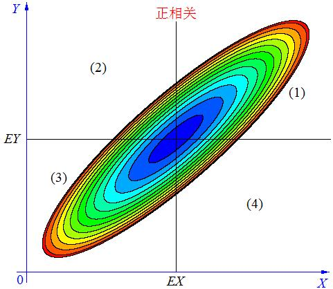
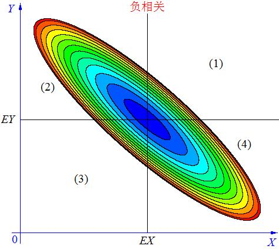
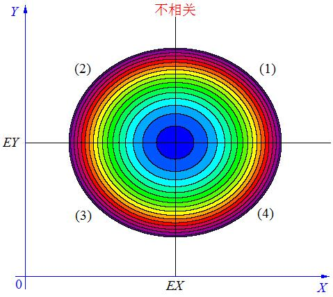

##指标

<!-- @import "[TOC]" {cmd="toc" depthFrom=1 depthTo=6 orderedList=false} -->

<!-- code_chunk_output -->

* [指标](#指标)
	* [均值](#均值)
	* [方差](#方差)
	* [协方差](#协方差)
	* [散度](#散度)

<!-- /code_chunk_output -->

###均值

###方差

###协方差

$$Cov(X, Y) = E((X-E(X))(Y-E(Y)))$$

协方差用于度量**各个维度偏离其均值的程度**。协方差的值如果为正值，则说明两者是正相关的(两者均向同一方向偏离均值)，结果为负值就说明负相关的，如果为0，也是就是统计上说的“相互独立”。
	

	
	图 样本正相关

 

随着X的增大，Y也会随之增大，X与Y有明显的正相关性，且可以发现大部分的坐标点都处于1，3象限，即相对于均值$\mu_x, \mu_y$而言，要么样本均大于均值或样本均小于均值，故式子$E((X-E(X))(Y-E(Y)))$在样本总体上总是大于0的

	
	图 样本负相关

 

随着X的增大，Y随之减小，X与Y有明显的负相关性，且可以发现大部分的坐标点都处于2，4象限，即相对于均值$\mu_x, \mu_y$而言，总有一部分样本大于均值，一部分样本小于均值，故式子$E((X-E(X))(Y-E(Y)))$在样本总体上总是小于0的

	
	图 样本不相关(相对独立)

 

X与Y的变化没有特定的方向性，坐标点均匀的分布于四个象限之内，式子$E((X-E(X))(Y-E(Y)))$在样本总体上等于0

### 散度

### 参考文献

[终于明白协方差的意义了](https://blog.csdn.net/GoodShot/article/details/79940438)