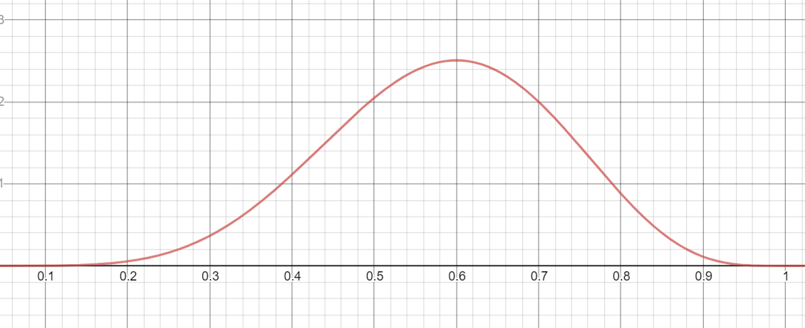
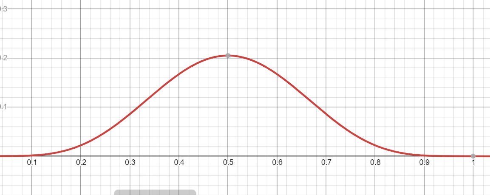
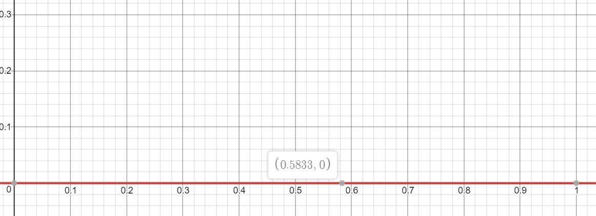
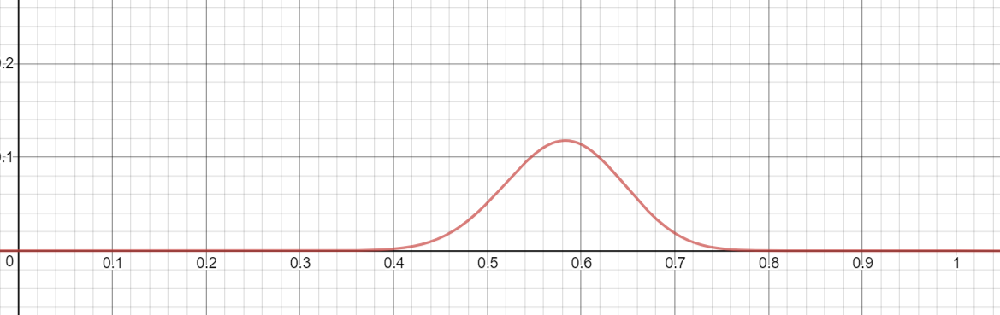

## 概率

<!-- @import "[TOC]" {cmd="toc" depthFrom=1 depthTo=6 orderedList=false} -->

<!-- code_chunk_output -->

- [概率](#概率)
  - [概率与似然](#概率与似然)
  - [最大似然估计](#最大似然估计)
  - [对数似然函数](#对数似然函数)
    - [公式推导](#公式推导)
  - [实际应用中的最大似然估计](#实际应用中的最大似然估计)
  - [References](#references)

<!-- /code_chunk_output -->

### 概率与似然

**概率**：已知硬币的参数，可以推测硬币的各种情况的可能性
**似然**：硬币的参数未知，通过抛硬币的情况推测硬币的参数

### 最大似然估计

**最大似然估计**：根据事实，推测出最可能的硬币参数

**具体过程**:

假设硬币的参数，计算实验结果的概率，结果越高，则假设的参数越可能为真。如果实验结果为抛10次硬币，有六次为正面(抛硬币事件服从[二项分布](distribution.md?###二项分布)的)。则硬币参数估计如下:

---
我们对硬币的参数进行预测，预测硬币参数为分别为0.5，0.6并分别使用二项分布计算实验结果概率。

当预测参数为0.5时，$$\binom{10}{6}0.5^6(1-0.5)^4\approx0.21$$

当预测参数为0.6时，$$\binom{10}{6}0.6^6(1-0.6)^4\approx0.25$$

此时可以得出，**0.6作为硬币参数比0.5更为合适**，因为硬币确实出现了六次正面，且参数为0.6时发生硬币六次正面的概率更大。当然，本次实验次数过少，如果增加试验次数选取的参数会更加具有可信度。

---
我们已知硬币是符合二项分布的，于是可以绘制出二项分布的函数曲线如下:

	
	图1：硬币6次正面时概率曲线(似然函数曲线)

 
可以看到p=0.6时，概率曲线取得最大值，即硬币最可能的参数为0.5。此时我们假设硬币出现了5次正面并重新绘制概率曲线图如下:

	
	图2：硬币5次正面时概率曲线

 
根据以上规律，求最大似然估计的问题就转化为了求似然函数极致的问题。

---
最大似然估计是针对**多次实验**的，之前的分析都是基于单次实验。此时我们增加试验次数到六次，且六次的结果分别是$\{5, 9, 6, 4, 5, 6\}$,则可以得到似然函数如下$$L(\theta)=f(x_1|\theta)f(x_2|\theta)...f(x_n|\theta)$$,其中，$f(x_i|\theta)$为硬币参数为$\theta$时的硬币分布概率，即$$f(x_i|\theta)=\binom{n}{x_i}\theta^{x_i}(1-\theta)^{n-x_i}$$。**似然函数表示在参数$\theta$下出现观测数据的概率**。此时可以绘制多次实验的似然函数曲线如下:

	
	图4：多次试验时概率曲线(系数未放大)

 

	
	图3：多次试验时概率曲线(系数*10000)

 

同理可以利用最大似然函数求解正态分布曲线的参数$\mu,\theta$，只需要根据实验结果写出该实验结果的似然函数并分别对参数$\mu,\theta$求导令等式为0即可。

当模型向上述例子中一样被假设为高斯分布时，最大似然估计的结果等价于最小二乘法。

### 对数似然函数

当我们将最大似然估计使用在[正态分布](distribution.md?###正态分布(高斯分布))等较为复杂的概率函数上时，总概率表达式实际上是很难微分，所以几乎总是通过对表达式取自然对数进行简化。自然对数是一个单调递增的函数，这意味着，如果$x$轴上的值增加，$y$轴上的值也会增加。这一点很重要，因为**它确保了概率的最大对数值出现在与原始概率函数相同的点上(保持原函数单调性)**。因此，我们可以用更简单的对数概率来代替原来的概率(**简化计算**)。

#### 公式推导

已知二点分布的概率分布
	$$P(X=x)=\theta^x(1-\theta)^{1-x}$$
及似然函数公式
	$$L(\theta)=f(x_1|\theta)f(x_2|\theta)...f(x_n|\theta)$$
可以得到似然函数$L(\theta)$如下:
	$$L(\theta)=\prod_{i=1}^n\theta^{x_i}(1-\theta)^{1-x_i}$$
对似然函数取对数得下式：
$$\begin{aligned}
	logL(\theta) = & log\prod_{i=1}^n\theta^{x_i}(1-\theta)^{1-x_i} \\
				 = & \sum_{i=1}^nlog\{\theta^{x_i}(1-\theta)^{1-x_i}\} \\
				 = & \sum_{i=1}^n[log\theta^{x_i}+log(1-\theta)^{1-x_i}] \\
				 = & \sum_{i=1}^n[x_ilog\theta + (1-x_i)log(1-\theta)]
\end{aligned}$$
对该式求导可得
$$\begin{aligned}
	\frac{\partial}{\partial\theta}logL(\theta) 
			= & \sum_{i=1}^n\frac{\partial}{\partial\theta}[x_ilog\theta + (1-x_i)log(1-\theta)] \\
			= & \sum_{i=1}^n[\frac{\partial}{\partial\theta}x_ilog\theta+\frac{\partial}{\partial\theta}(1-x_i)log(1-\theta)] \\ 
			= & \frac{1}{\theta}\sum_{i=1}^nx_i - \frac{1}{1-\theta}\sum_{i=1}^n(1-x_i)
\end{aligned}$$

令等式左边为0求$\mu$，

$$\begin{aligned}
	0 & = \frac{1}{\theta}\sum_{i=1}^nx_i - \frac{1}{1-\theta}\sum_{i=1}^n(1-x_i) \\ 
	\frac{1}{\theta}\sum_{i=1}^nx_i & = \frac{1}{1-\theta}\sum_{i=1}^n(1-x_i) \\ 
	\frac{1}{\theta}\sum_{i=1}^nx_i & = \frac{1}{1-\theta}(n-\sum_{i=1}^nx_i) \\
	\frac{1}{1-\theta}n & = (\frac{1}{\theta}+\frac{1}{1-\theta})\sum_{i=1}^nx_i \\ 
	\theta{n} & = (1-\theta+\theta)\sum_{i=1}^nx_i \\
	\theta & = \frac{1}{n}\sum_{i=1}^nx_i
\end{aligned}$$

此处求出的$\theta$即为所求分布的参数

汇总上述最大似然估计的步骤如下：
- 写出似然函数；
- 对似然函数取对数，并整理；
- 求导数，令导数为0，得到似然方程；
- 解似然方程，得到的参数即为所求；

### 实际应用中的最大似然估计

在真实的场景中，对数似然函数的导数仍然是难以解析的(也就是说，很难甚至不可能人工对函数求微分)。因此，一般采用期望最大化(EM)算法等迭代方法为参数估计找到数值解。

如已知一个学校的所有学生的身高样本$X_1,X_2,X3_3…X_n$，并且男生和女生都分别服从$N(\mu{男}，\sigma{男})$和N(\mu女，\sigma女)的高斯分布。目的是要求出μ男，σ男，μ女，σ女这四个参数,此时同时有两个高斯分布混合在一起，我们要去求出两个高斯分布各自的均值与标准差参数。此时我们的建模不能是一个简单的高斯分布，而是[混合高斯模型](./distribution.md?###混合高斯模型)(GMM),即我们的参数变为求$\pi, \mu, \sigma$。

于是可以建立似然函数
$$L_{\pi, \mu, \sigma}(x)=\sum_{i=1}^nlog(\sum_{j=1}^k\pi_jN(x_i|\mu_j, \sigma_j))$$
此处由于对数函数有加和，无法直接用求导解方程的方法来求最大值。

开始EM算法:
1. 估计数据分组
$$\gamma(i, j) = \frac{\pi_jN(x_i|\mu_j, \sigma_j)}{\sum_{j=1}^k\pi_jN(x_i|\mu_j, \sigma_j)}$$
$\gamma(i, j)$表示$x_i$分别属于男生组与女生组的概率
2. 更新分布中参数
$$\begin{cases}
N_j = \sum_{i=1}^n\gamma(i,j) \\ 
\mu_j = \frac{1}{N_j}\sum_{i=1}^n\gamma(i,j)x_i \\ 
\sigma_j = \frac{1}{N_j}\sum_{i=1}^n\gamma(i,j)(x_i - \mu_j)(x_i - \mu_j)^T \\
\pi_j = \frac{N_j}{N}=\frac{1}{N}\sum_{i=1}^n\gamma(i,j)
\end{cases}$$

### References

1. [如何通俗地理解“最大似然估计法”?](https://www.matongxue.com/madocs/447.html)
1. [二项分布(Binomial Distribution)](https://blog.csdn.net/huangjx36/article/details/77990392)
1. [参数估计](https://wenku.baidu.com/view/ced1561ecbaedd3383c4bb4cf7ec4afe04a1b185.html)
1. [从最大似然估计开始，你需要打下的机器学习基石](https://blog.csdn.net/tkkzc3E6s4Ou4/article/details/79016194)
1. [最大似然估计 （MLE）与 最大后验概率（MAP）在机器学习中的应用](https://blog.csdn.net/zlp_zky/article/details/78452042)
1. [王小草【机器学习】笔记--EM算法](https://blog.csdn.net/sinat_33761963/article/details/53520898)