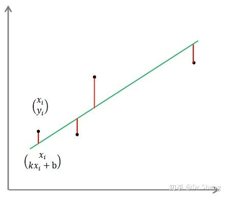

<!-- @import "[TOC]" {cmd="toc" depthFrom=1 depthTo=6 orderedList=false} -->

<!-- code_chunk_output -->

- [最小二乘法](#最小二乘法)
  - [最小二乘法的矩阵解法](#最小二乘法的矩阵解法)
  - [最小二乘法的局限性](#最小二乘法的局限性)
- [Linear Regression(线性回归)](#linear-regression线性回归)
  - [简单线性回归](#简单线性回归)
  - [多元线性回归](#多元线性回归)
- [Logistic Regression(逻辑回归、对数几率回归)(二元逻辑回归)](#logistic-regression逻辑回归-对数几率回归二元逻辑回归)
- [多元逻辑回归](#多元逻辑回归)
- [逻辑回归与线性回归的关系](#逻辑回归与线性回归的关系)
- [References](#references)

<!-- /code_chunk_output -->

#### 最小二乘法

最小二乘法，顾名思义就是二范数的最小距离的办法，即
$$ L = \sum { (观测值 - 预测值)^2} $$

我们的目标就是得到使目标函数最小化时候的拟合函数的模型。拿线性回归举例，假设我们的样本集的样本容量为n，$T = {(x_1, y_1), (x_2, y_2), ..., (x_n, y_n)}$

样本的拟合函数采用n次多项式进行拟合，$$h_{\theta}(x) = \theta_0 + \theta_1{x} + \theta_2{x^2} + \theta_m{x^m}$$

最小二乘法的目的就是估计一组参数$\theta$，使其对于当前所有的样本可以实现最小的平方损失。

##### 最小二乘法的矩阵解法

最小二乘法有代数解法和矩阵解法两种，代数解法暂时精力不足不做了解，主要了结了一下矩阵解法。具体流程如下:

上文中我们已经知道我们的拟合函数为$h_\theta(x)$，我们要估计的参数为$\theta= [\theta_1, \theta_2, ..., \theta_m ]$，样本数为n，每个样本的特征数为m。此时，拟合函数的矩阵形式可以表述为
$$ h_\theta(x) = X\theta$$
其中，$shape(X) = (n, m), shape(\theta) = (m, 1), h_\theta(x)$表示多项式函数对于所有样本的预测值。

该函数的损失函数为
$$L(\theta) = \frac{1}{2}(X\theta - Y)^T(X\theta - Y)$$, 其中Y样本的观测值，即真实值。根据最小二乘法需要找到目标函数最小值的原理，我们需要求导取0寻找极小值。计算过程如下:
$$\begin{aligned}
\frac{\partial{L(\theta)}}{\partial{\theta}} & = \frac{1}{2}\frac{\partial{((\theta^TX^T - Y^T)(X\theta - Y)})}{\partial{\theta}}\\
& = \frac{1}{2}\frac{\partial{((\theta^TX^T - Y^T)(X\theta - Y)})}{\partial{\theta}} \\ 
& = \frac{1}{2}\frac{\partial{((\theta^T X^TX \theta - \theta^T X^TY - Y^TX\theta + Y^TY)}}{\partial{\theta}} \\ 
& = X^TX\theta - X^TY = 0 \\ 
\end{aligned}$$

解之得，
$$\theta = (X^TX)^{-1}X^TY$$

##### 最小二乘法的局限性

该方法并不是任何情况都适用的，
- 当$X^TX$的逆矩阵不存在时不可用
- 当X特征过多时不适合使用，因为求取X的逆的效率会很低，可以考虑去除冗余特征后再使用该方法；
- 当拟合函数不是线性函数的时候不可用

#### Linear Regression(线性回归)

拟合符合数据分布的直线，即估计参数w和b

上文已经提到，最小二乘法是用来估计一组参数拟合一个多项式函数，线性回归可以分为简单线性回归与多元线性回归。目的是给定一组点集，拟合一个线性函数可以描述该数据的分布规律。

##### 简单线性回归

对于我们的点集$T = {(x_1, y_1), (x_2, y_2), ..., (x_n, y_n)}$，假设我们的直线表达式为$\hat{y}=kx+b$, 则函数拟合的目标函数可以表述为
$$L = \sum_i (\hat{y_i} - y_i)^2 = \sum_i (kx_i + b - y_i)^2$$

将上式改写为矩阵形式，
$$L = \begin{bmatrix}d_1 \\ d_2 \\ ... \\ d_n \end{bmatrix}
    = \begin{bmatrix}x_1 & 1 \\ x_2 & 1 \\ ... \\ x_n & 1 \end{bmatrix}
      \begin{pmatrix}k \\ b \end{pmatrix}
      - \begin{bmatrix}y_1 \\ y_2 \\ ... \\ y_n \end{bmatrix}
    = Ak - Y
$$

此时，按照上文最小二乘法的思想，可以对上式求导取0得到令L最小时的参数k，即所求直线的参数。
$$\frac{\partial{L}}{\partial{k}} = A^TAk - A^TY = 0$$

可以求得参数k的值：
$$k = (A^TA)^{-1}A^TY$$

需要注意的是，我们求的最小值是竖直方向与直线的最小值而不是垂直方向与直线的最小值。目前收集到的主要原因可能有:
- x轴方向没有测量值可以作为参考，我们能收集到的只是竖直方向的测量值，即虽然可视化的效果看来x轴方向上点与点之间的距离是一定的，但是实际情况中x轴不同点之间是没有什么关联性的。
- 横轴与纵轴的量纲不同，无法定义一种合理的"垂直距离"进行距离优化

此外，除了使用最小二乘法进行求解，还可以使用梯度下降法求解每一步长的梯度更新进行参数估计，此方法的使用情况更多。

##### 多元线性回归

多元线性回归与简单线性回归在矩阵解法方面是一致的，
$$\begin{aligned}
L & = \begin{bmatrix}d_1 \\ d_2 \\ ... \\ d_n \end{bmatrix}
    = \begin{bmatrix}x_11 & x_12 & ... & x_1m & 1 \\ 
                     x_21 & x_22 & ... & x_2m & 1 \\
                     ... & ... & & ... & ... \\ 
                     x_n1 & x_n2 & ... & x_nm & 1 \\ 
      \end{bmatrix}
      \begin{pmatrix}k \\ b \end{pmatrix}
      - \begin{bmatrix}y_1 \\ y_2 \\ ... \\ y_n \end{bmatrix} \\
L & = \begin{bmatrix}d_1 \\ d_2 \\ ... \\ d_n \end{bmatrix}
    = \begin{bmatrix}x_1^T & 1 \\ 
                     x_2^T & 1 \\
                     ... & ... \\ 
                     x_n^T & 1 \\ 
      \end{bmatrix}
      \begin{pmatrix}k_1 \\ ... \\ k_m \\ b \end{pmatrix}
      - \begin{bmatrix}y_1 \\ y_2 \\ ... \\ y_n \end{bmatrix} \\
    & = Ak - Y \\
\end{aligned}$$

求解得，
$$k = (A^TA)^{-1}A^TY$$

#### Logistic Regression(逻辑回归、对数几率回归)(二元逻辑回归)

Logistic Regression 虽然被称为回归，但其实际上是分类模型，并常用于二分类。Logistic Regression 因其简单、可并行化、可解释强深受工业界喜爱。Logistic 回归的本质是：假设数据服从这个分布，然后使用极大似然估计做参数的估计。

Logistic 分布是一种连续型的概率分布，其分布函数和密度函数分别为：
$$\begin{aligned}
分布函数: F(x) & = P(X \le x) = \frac{1}{1 + e^{-{(x - \mu)}/{\gamma}}} \\
密度函数：f(x) & = F'(x) = \frac{e^{-{(x - \mu)}/{\gamma}}}{\gamma {(1 + e^{-{(x - \mu)}/{\gamma}})^2}}
\end{aligned}$$ Logistic 分布是由其位置和尺度参数定义的连续分布。Logistic 分布的形状与正态分布的形状相似，但是 Logistic 分布的尾部更长，所以我们可以使用 Logistic 分布来建模比正态分布具有更长尾部和更高波峰的数据分布。在深度学习中常用到的 Sigmoid 函数就是 Logistic 的分布函数在$\mu=0, \gamma=1$的特殊形式。

以二分类为例，对于所给数据集假设存在这样的一条直线可以将数据完成线性可分。

决策边界可以表示为​$w_1x_1 + w_2x_2 + b = 0$，假设某个样本点$h_w(x) = w_1x_1 + w_2x_2 + b > 0$那么可以判断它的类别为 1，这个过程其实是感知机。**Logistic回归还需要加一层，它要找到分类概率$P(Y=1)$与输入向量$x$的直接关系，然后通过比较概率值来判断类别**。

考虑二分类问题，给定数据集
$$D = (x_1, y_1), (x_2, y_2), ..., (x_n, y_n), x_i \in R^n, y_i \in {0, 1}, i=1, 2, ..., N$$ **考虑到$w^Tx+b$取值是连续的，因此它不能拟合离散变量。可以考虑用它来拟合条件概率$P(Y=1|x)$，因为概率的取值也是连续的**。但是对于$w \neq 0$（若等于零向量则没有什么求解的价值）， $w^Tx+b$取值为$R$，不符合概率取值为0到1，因此考虑采用广义线性模型(利用阶跃函数使其转化为0到1的值域)。
$$p(Y=1|x) = \begin{cases}
0, & z \le 0 \\
0.5, & z = 0 \\
1, & z \ge 0
\end{cases}, z = w^Tx+b$$ **以上函数不可微，因此需要使用对数几率函数进行替代**，
$$\begin{aligned}
y & = \frac{1}{1+e^{-(w^Tx+b)}} \\ 
1 & = y(1+e^{-(w^Tx+b)}) \\
1 & = y + ye^{-(w^Tx+b)} \\
1 - y & = ye^{-(w^Tx+b)} \\
ln(\frac{1-y}{y}) & = ln(e^{-(w^Tx+b)}) \\
w^Tx + b & = -ln(\frac{1-y}{y}) = ln(\frac{y}{1-y})
\end{aligned}$$ 我们将$y$视为$x$为正例的概率，则$1-y$为$x$为其反例的概率。两者的比值称为几率(odds)，指该事件发生与不发生的概率比值。若事件发生的概率为$p$，则有
$$\begin{aligned}
w^Tx + b & = ln(\frac{P(Y=1|x)}{1-P(Y=1|x)}) \\
P(Y=1|x) & = \frac{1}{1+e^{-(w^Tx+b)}}
\end{aligned}$$ 也就是说，**输出$Y=1$的对数几率是由输入$x$的线性函数表示的模型，这就是逻辑回归模型**。当$w^Tx+b$的值越接近正无穷，$P(Y=1|x)$概率值也就越接近1。

对于上述结论，在确定了逻辑回归的数学表达式后，剩下就需要确定模型中的参数。此处使用极大似然估计法进行求解。即找到一组参数，使得在这组参数下，我们的数据的似然度（概率）最大。设
$$\begin{aligned}
P(Y=1|x) & = p(x)\\
P(Y=0|x) & = 1 - p(x)
\end{aligned}$$ 又已知二项分布的概率分布表达式为
$$P(X=y) = p(x)^y(1-p(x))^{1-y}$$ 则，似然函数可以表示为
$$L(w) = \prod_{i-1}^{n}{ p(x_i)^{y_i}(1-p(x_i))^{1-y_i} }$$ 为了求解该函数，一般会对该函数取对数，此时
$$\begin{aligned}
lnL(w, b) & = \sum_{i=1}^{n}{ [y_ilnp(x_i) + (1-y_i)ln(1-p(x_i))] } \\ 
     & = \sum_{i=1}^{n}{ [y_iln{\frac{p(x_i)}{1-p(x_i)}} + ln(1-p(x_i))] } \\
     & = \sum_{i=1}^{n}{ [y_i(w^T \cdot x + b) + ln(1 - \frac{1}{1+e^{-(w^T \cdot x + b)}})]} \\
     & = \sum_{i=1}^{n}{ [y_i(w^T \cdot x + b) + ln(\frac{e^{-(w^T \cdot x + b)}}{1+e^{-(w^T \cdot x + b)}})]} \\
     & = \sum_{i=1}^{n}{ [y_i(w^T \cdot x + b) + ln(e^{-(w^T \cdot x + b)}) - ln(1 + e^{-(w^T \cdot x + b)}))]} \\
     & = \sum_{i=1}^{n}{ [(y_i-1)(w^T \cdot x + b) - ln(1 + e^{-(w^T \cdot x + b)})]} \\
\end{aligned}$$ 此时，该模型的损失函数为
$$J(w, b) = -\frac{1}{n}lnL(w, b)$$ 即最大化似然函数和最小化损失函数等价。

求解上述损失函数可以根据梯度下降法或牛顿法进行求解。

#### 多元逻辑回归

相比于二元逻辑回归，多元逻辑回归的重点在于建立自变量$x$与概率$p(x)$的关系。已知逻辑回归表达式
$$y = \frac{1}{ 1 + e^{ -w^Tx } }$$ 令$ w = w_2 - w_1$，
$$\begin{aligned}
y & = \frac{1}{ 1 + e^{ -(w_2 - w_1)^Tx } } \\
& = \frac{1}{ 1 + e^{ -w_2^Tx + w_1^Tx } } \\
& = \frac{1}{ 1 + \frac{e^{w_1^Tx}}{e^{w_2^Tx}}} \\
& = \frac{e^{w_2^Tx}}{e^{w_1^Tx} + e^{w_2^Tx}}
\end{aligned}$$ 即，如果$y>0.5$时，可以被划分为第一类，$y<0.5$时，可以被划分为第0类。此时类别判断函数可以表示为,
$$f(x) = \begin{cases}
0, & \frac{e^{w_2^Tx}}{e^{w_1^Tx} + e^{w_2^Tx}} \le 0.5 \\
1, & \frac{e^{w_2^Tx}}{e^{w_1^Tx} + e^{w_2^Tx}} > 0.5
\end{cases}$$ 可以看到最终的类别预测跟分子成正比。对于多类的情况，第k类的概率正比于$e^{w_k^Tx}$，此时，多分类逻辑回归模型的概率公式为
$$p(Y=k|x) = \frac{e^{w_k^Tx}}{e^{w_1^Tx} + e^{w_2^Tx} + ... + e^{w_n^Tx}}$$ 根据该概率公式即可对多元逻辑回归模型进行参数求解。

总结一下，逻辑回归主要通过对数几率函数(sigmoid为该函数的特例)将离散值的类别值转化为连续的概率值，如果是二分类的逻辑回归就使用sigmoid函数，如果是多分类的逻辑回归则使用

#### 逻辑回归与线性回归的关系

**逻辑回归算法是一种广义的线性回归分析方法，其仅在线性回归算法的基础上，套用一个逻辑函数，从而完成对事件发生的概率进行预测。我们在线性回归中可以得到一个预测值，然后将该值通过逻辑函数进行转换，这样就能够将预测值变成概率值，再根据概率值实现分类。**

线性回归的目的是为了拟合出那条符合数据分布的直线，而逻辑回归的目的其实是为了找到一条直线并进行分类预测。

#### References

1. [最小二乘法（least sqaure method）](https://zhuanlan.zhihu.com/p/38128785)
1. [最小二乘法小结](https://www.cnblogs.com/pinard/p/5976811.html)
1. [最小二乘拟合直线真的没问题么?](https://zhuanlan.zhihu.com/p/36429715)
1. [简单线性回归模型](https://zhuanlan.zhihu.com/p/73494604)
1. [机器学习 逻辑回归（非常详细）](https://zhuanlan.zhihu.com/p/74874291)