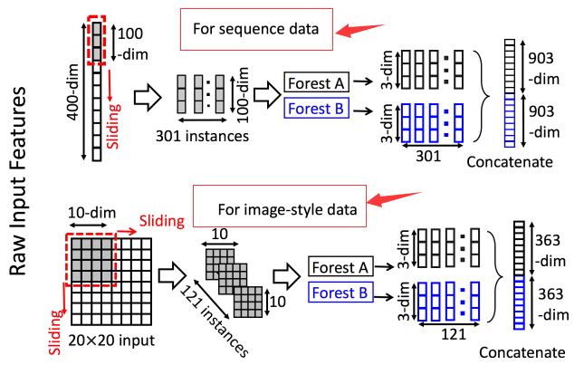
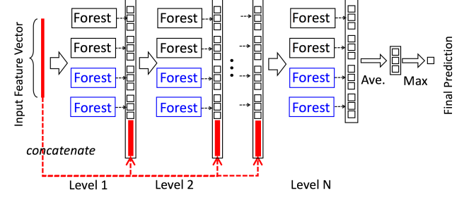

<!-- @import "[TOC]" {cmd="toc" depthFrom=1 depthTo=6 orderedList=false} -->

<!-- code_chunk_output -->

- [GBDT(Gradient Boosting Decision Tree)与xgboost](#gbdtgradient-boosting-decision-tree与xgboost)
  - [GBDT简述](#gbdt简述)
  - [GBDT解决回归问题](#gbdt解决回归问题)
  - [GBDT解决分类问题](#gbdt解决分类问题)
  - [GBDT损失函数](#gbdt损失函数)
  - [xgboost](#xgboost)
    - [xgboost与lightGBM区别](#xgboost与lightgbm区别)
- [GCForest及其改进](#gcforest及其改进)
  - [DNN和GCForest的优缺点](#dnn和gcforest的优缺点)
  - [主要思路](#主要思路)
    - [多粒度扫描](#多粒度扫描)
    - [级联森林](#级联森林)
  - [GCForest改进](#gcforest改进)
- [References](#references)

<!-- /code_chunk_output -->

### GBDT(Gradient Boosting Decision Tree)与xgboost

#### GBDT简述

GBDT(Gradient Boosting Decision Tree)是boosting系列算法中的一个代表算法，它是一种迭代的决策树算法，由多棵决策树组成，所有树的结论累加起来作为最终答案。回顾下Adaboost，我们是利用前一轮迭代弱学习器的误差率来更新训练集的权重，这样一轮轮的迭代下去。GBDT也是迭代，使用了前向分布算法，但是**弱学习器限定了只能使用CART回归树模型，同时迭代思路和Adaboost也有所不同**。

在GBDT的迭代中，假设我们前一轮迭代得到的强学习器是$f_t−1(x)$, 损失函数是$L(y,f_{t−1}(x))$, 我们本轮迭代的目标是找到一个CART回归树模型的弱学习器$h_t(x)$，让本轮的损失函数$L(y,f_t(x))=L(y,f_{t−1}(x)+h_t(x))$最小。也就是说，本轮迭代找到决策树，要让样本的损失尽量变得更小。**这里有一点值得注意的是，$f_{t-1}(x)+ h_t(x)$共同损失成了损失函数，而不是$L(y,f_{t−1}(x)) + L(h_t(x))$，这说明GBDT的决策结果是由**多颗决策树共同组成，每轮迭代生成一颗决策树，所有结论累加起来才是最终答案**，$f_{t-1}(x)$表示上一颗树的输出结果，虽然它是上一轮迭代形成的，但是树与树之间并不会相互覆盖。比如我们需要预测一个购物金额为3k，经常去百$w^Tx+b$关问题$R$。并且我们已经实现建好了**第一棵树**，即购物金额小于1k的女生的年龄为15岁，大于1k的女生的年龄为25岁(CART回归树)，并且以此为基础建立了**第二棵树**，经常到百度进行提问的女生年龄减1岁，经常到百度回答问题的女生年龄增1岁。根据以上建立的两棵树我们就可以得出这个女生的最终预测年龄为25-1=24岁。

#### GBDT解决回归问题

GBDT的分类问题与回归问题是分开讨论的。因为回归问题的输出是连续值，而分类问题的输出是离散的类别向量。而类别向量是不可微的，需要转化为对数几率函数才可以进行计算。

GBDT回归问题的解决策略主要通过负梯度不断建立CART回归树并最小化损失函数得到最终预测结果。

#### GBDT解决分类问题

GBDT的分类算法从思想上和GBDT的回归算法没有区别，但是由于样本输出不是连续的值，而是离散的类别，导致我们无法直接从输出类别去拟合类别输出的误差。

为了解决这个问题，主要有两个方法，一个是用指数损失函数，此时GBDT退化为Adaboost算法。另一种方法是用类似于逻辑回归的对数似然损失函数的方法。也就是说，我们用的是类别的预测概率值和真实概率值的差来拟合损失。本文仅讨论用对数似然损失函数的GBDT分类。而对于对数似然损失函数，我们又有二元分类和多元分类的区别。

#### GBDT损失函数

对于分类算法，其损失函数一般有对数损失函数和指数损失函数两种:
- 指数损失函数$$L(y, f(x)) = e^{-yf(x)}$$

- 对数损失函数。对数损失函数分二元对数损失函数和多元对数损失函数，二元对数损失函数为$$L(y, f(x)) = log(1 + e^{-yf(x)})$$ 多元对数损失函数为$$L(y, f(x)) = -\sum_{k=1}^{K}{y_k \log{p_k(x)}}$$

对于回归算法，常见的损失函数有四种，
- 均方差损失 $$L(y, f(x)) = (y - f(x))^2$$
- 绝对损失 $$L(y, f(x)) = |y - f(x)|$$
- **Huber损失**，它是均方差和绝对损失的折衷产物，对于远离中心的异常点，采用绝对损失，而中心附近的点采用均方差。这个界限一般用分位数点度量。损失函数如下： $$L(y, f(x)) = \begin{cases}
\frac{1}{2}(y - f(x))^2, & |y-f(x)| \le \delta \\
\delta{(|y - f(x)| - \frac{\delta}{2})}, & |y-f(x)| > \delta
\end{cases}$$
- 分位数损失 $$L(y, f(x)) = \sum_{y \ge f(x)}{\theta{|y-f(x)|}} + \sum_{y < f(x)}{(1 - \theta){|y-f(x)|}}$$

对于Huber损失和分位数损失，主要用于健壮回归，也就是减少异常点对损失函数的影响。

#### xgboost

XGBoost是GBDT的一种高效实现，但是里面也加入了很多独有的思路和方法，值得单独讲一讲。因此讨论的时候，我会重点分析和GBDT不同的地方。

作为GBDT的高效实现，XGBoost是一个上限特别高的算法，因此在算法竞赛中比较受欢迎。简单来说，对比原算法GBDT，XGBoost主要从下面三个方面做了优化：

- 一是算法本身的优化：在算法的弱学习器模型选择上，对比GBDT只支持决策树，还可以直接很多其他的弱学习器。在算法的损失函数上，除了本身的损失，还加上了正则化部分。在算法的优化方式上，GBDT的损失函数只对误差部分做负梯度（一阶泰勒）展开，而XGBoost损失函数对误差部分做二阶泰勒展开，更加准确。算法本身的优化是我们后面讨论的重点。
- 二是算法运行效率的优化：对每个弱学习器，比如决策树建立的过程做并行选择，找到合适的子树分裂特征和特征值。在并行选择之前，先对所有的特征的值进行排序分组，方便前面说的并行选择。对分组的特征，选择合适的分组大小，使用CPU缓存进行读取加速。将各个分组保存到多个硬盘以提高IO速度。
- 三是算法健壮性的优化：对于缺失值的特征，通过枚举所有缺失值在当前节点是进入左子树还是右子树来决定缺失值的处理方式。算法本身加入了L1和L2正则化项，可以防止过拟合，泛化能力更强。

在上面三方面的优化中，第一部分算法本身的优化是重点也是难点。现在我们就来看看算法本身的优化内容。

##### xgboost与lightGBM区别

暂缓这部分内容，时间充足了再了解

### GCForest及其改进

gcForest，其核心思想是：利用级联森林（决策树集成）方法去学习生成模型，一定程度上可以弥补DNN的部分劣势！

#### DNN和GCForest的优缺点

DNN
- DNN需要大的样本集，在小样本数据集上表现不可观；
- DNN本身就是复杂的模型，所以训练过程很复杂，需要大量的复杂计算；
- 参数太多，需要花费大量的调参时间。（坊间流行一句话：DNN的训练更像是艺术，而不是科学或者工程）；
- DNN在大数据集上的效果确实很好。

gcForest
- gcForest在大数据集上的表现和DNN分庭抗礼，在小数据集上也表现很好；
- 参数少，调参简单，在很多领域的不同数据集上，使用默认设置，结果都很好；
- 训练过程简单、理论体系更易懂；
- 执行效率高，gcForest在一台PC上的效率相当于DNN在GPU机器上的效率；
- 并行度高，作为Forest，有着天然的高并行性。

#### 主要思路

gcForest的核心主要包括两大块：级联森林（Cascade Forest）和多粒度扫描（Multi-Grained Scanning）。

##### 多粒度扫描

多粒度扫描是为了增强级联森林，为了**对特征做更多的处理**的一种技术手段。

对于序列数据，假设我们的输入特征是400维，扫描窗口大小是100维，这样就得到301个100维的特征向量，每个100维的特征向量对应一个3分类的类向量，即得到：301个*3维类向量！最终每棵森林会得到903维的衍生特征变量！

于图像数据的处理和序列数据一样，图像数据的扫描方式当然是从左到右、从上到下，而序列数据只是从上到下。当然，**可以用各种尺寸不等的扫描窗口去扫描，这样就会得到更多的、更丰富的特征关系**！

##### 级联森林

级联森林的每一层都是由好多个森林（既有随机森林，又有完全随机森林）组成，而每一个森林又是由好多个决策树（Decision Tree）组成，所以这种组合是集成的集成！其中每一层的随机森林和完全随机森林保证了模型的多样性！具体的级联森林结构如下图所示。

论文中级联森林**每一层包括两个完全随机森林（黑色）和两个随机森林（蓝色）**。

每个完全随机森林包含500个完全随机的决策树，每个决策树的每个节点都是随机选择一个特征做分裂，直至每一个叶节点包含的实例属于同一个类，或者实例数目不多于10个；

每个随机森林也是500个决策树，每个决策树的生成是随机选择sqrt(d)个特征（d输入的总特征），每次选择gini值最高的做分裂。

**级联森林的迭代终止条件：迭代到效果不能提升就停止。**

#### GCForest改进

### References

1. [梯度提升树(GBDT)原理小结](https://www.cnblogs.com/pinard/p/6140514.html)
1. [【机器学习算法总结】GBDT](https://blog.csdn.net/yyy430/article/details/85108797)
1. [小菜鸟对周志华大神gcForest的理解](https://cloud.tencent.com/developer/article/1004803)
