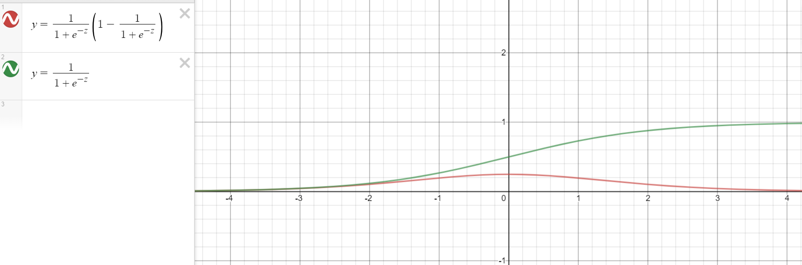

<!-- @import "[TOC]" {cmd="toc" depthFrom=1 depthTo=6 orderedList=false} -->

<!-- code_chunk_output -->

- [交叉熵损失函数](#交叉熵损失函数)
  - [交叉熵的几种表达形式](#交叉熵的几种表达形式)
      - [Binary CrossEntropy](#binary-crossentropy)
      - [Categorical CrossEntropy](#categorical-crossentropy)
  - [对数似然函数与交叉熵的关系](#对数似然函数与交叉熵的关系)
  - [均方误差与交叉熵误差(sigmoid为激活函数)](#均方误差与交叉熵误差sigmoid为激活函数)
    - [均方误差(MSE)与梯度更新](#均方误差mse与梯度更新)
    - [交叉熵误差与梯度更新](#交叉熵误差与梯度更新)
    - [对比与结论](#对比与结论)
  - [多分类交叉熵函数的梯度更新(softmax为激活函数)](#多分类交叉熵函数的梯度更新softmax为激活函数)
- [References](#references)

<!-- /code_chunk_output -->

### 交叉熵损失函数

#### 交叉熵的几种表达形式

交叉熵的loss函数形式是比较统一的，之所以经常见到不同形式的交叉熵主要取决于你的分类任务是二分类还是多分类。

###### Binary CrossEntropy

$$L = -\frac{1}{n} \sum_i{{y_i \log{a_i} + (1-y_i) \log{(1-a_i)}}}$$

###### Categorical CrossEntropy

$$L = -\frac{1}{n} \sum_i{a_{i1}}\log{y_{i1} + a_{i2}}\log{y_{i2} + ... + a_{im}}\log{y_{im}}$$ 其中，n是样本数，m是类别数

#### 对数似然函数与交叉熵的关系

注：以下比较是在单个样本下的对数似然函数公式及交叉熵公式

二元分布下对数似然函数的公式为
$$L = ylnp(x) + (1-y)ln(1-p(x))$$ 交叉熵的公式为
$$H(p, q) = -\sum{ p(x)\log q(x) }$$ 看起来两者公式是非常一致的。

这里X的分布模型即样本集的真实分布模型$p(x)$，这里模型$q(x)$即想要模拟真实分布模型的机器学习模型。可以说**交叉熵是直接衡量两个分布，或者说两个model之间的差异**。而似然函数则是解释以model的输出为参数的某分布模型对样本集的解释程度。因此，可以说这两者是“同貌不同源”，但是“殊途同归”啦。

#### 均方误差与交叉熵误差(sigmoid为激活函数)

为什么常常使用交叉熵误差而不是均方误差作为神经网络的损失函数？可以从两个函数的梯度上看出一些端倪。

##### 均方误差(MSE)与梯度更新

首先是均方误差，均方误差的损失函数为$$L=\frac{1}{2n} {\sum_{i}{||a_i - y_i||^2}}$$ $n$为样本数量，$a_i$为神经网络对当前样本的预测值，$y_i$为当前样本的标签。$a_i = \sigma(z_i) = sigmoid(z_i) = sigmoid(wx_i+b)$。

<!-- 对均方误差求梯度 -->
简化上式为$n=1$的情况，此时$$L = \frac{(a-y)^2}{2}$$ 那么参数$w$和$b$的梯度分别为$$\begin{aligned}
\frac{\partial{L}}{\partial{w}} & = 2 * 1/2 * (a-y) * \sigma'(z) * (wx+b)'_w \\
& = (a-y) * \sigma'(z) * x
\end{aligned}$$ $$\begin{aligned}
\frac{\partial{L}}{\partial{b}} & = 2 * 1/2 * (a-y) * \sigma'(z) * (wx+b)'_b \\
& = (a-y) * \sigma'(z) * 1
\end{aligned}$$

##### 交叉熵误差与梯度更新

其次是交叉熵误差，交叉熵误差的损失函数为$$L = -\frac{1}{n} \sum_i{{y_i \log{a_i} + (1-y_i) \log{(1-a_i)}}}$$

<!-- 对交叉熵误差求梯度 -->
同样简化上式为$n=1$的情况，此时$$L = -(y \log{a} + (1-y) \log{(1-a)})$$ 计算w和b的梯度为$$\begin{aligned}
\frac{\partial{L}}{\partial{w}} & = -[\frac{y}{a} * \sigma'(z) * x -\frac{1-y}{1-a}*\sigma'(z)*x]\\
& = -[ \sigma'(z)*x*(\frac{y}{a} - \frac{1-y}{1-a}) ] \\
& = -[ \sigma(z)(1-\sigma(z))*x*(\frac{y}{a}-\frac{1-y}{1-a}) ] \\
& = -[ a(1-a)*x*(\frac{y}{a}-\frac{1-y}{1-a}) ] \\
& = -x[ a(1-a)\frac{y-a}{a(1-a)} ] \\
& = x(a-y) \\
\end{aligned}$$ $$\begin{aligned}
\frac{\partial{L}}{\partial{b}} & = -[ \frac{y}{a}*\sigma'(x)-\frac{1-y}{1-a}*\sigma'(x)] \\
& = a - y \\
\end{aligned}$$ 

##### 对比与结论

对比上述两个损失函数对参数w和b求导后的结果可以看出，均方误差求导后的梯度始终跟$\sigma'(z)$是有关系的，而交叉熵误差则不然。可见，关键就出在激活函数$$\sigma(x) = sigmoid(z) = \frac{1}{1+e^{-z}}$$上，sigmoid的函数图像存在两端导数趋于零的特性，因此当z的值较大时，$\sigma'(z)$的值会趋于零，进而降低神经网络的收敛速度，因此不建议使用均方误差作为神经网络分类问题的损失函数。因此，结论为，**当神经网络最后一层的激活函数是sigmoid函数时，使用二进制交叉熵损失函数可以解决sigmoid梯度消失的问题**。

#### 多分类交叉熵函数的梯度更新(softmax为激活函数)

### References

- [均方误差和交叉熵损失函数比较](https://www.cnblogs.com/aijianiula/p/9651879.html)
- [交叉熵代价函数（作用及公式推导）](https://blog.csdn.net/u014313009/article/details/51043064)
- [常见的损失函数](https://blog.csdn.net/legalhighhigh/article/details/81409551)