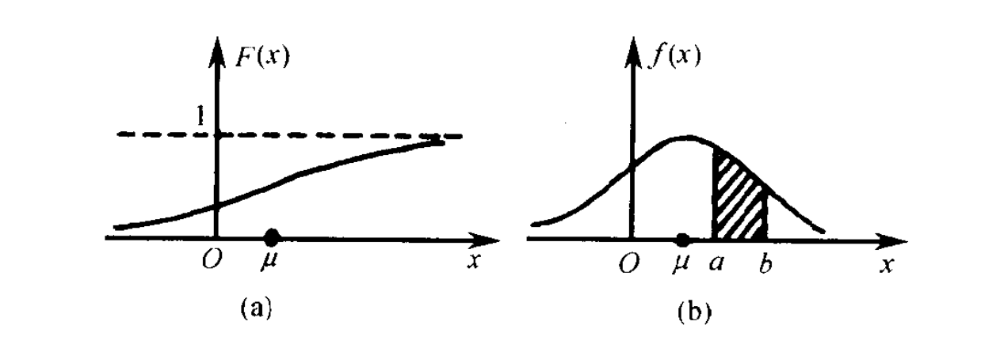

<!-- @import "[TOC]" {cmd="toc" depthFrom=1 depthTo=6 orderedList=false} -->

<!-- code_chunk_output -->

* [联合概率、边缘概率与条件概率](#联合概率-边缘概率与条件概率)
* [概率函数、概率分布函数与概率密度函数](#概率函数-概率分布函数与概率密度函数)
* [二项分布](#二项分布)
* [正态分布(高斯分布)](#正态分布高斯分布)
* [二项分布与正态分布关系](#二项分布与正态分布关系)
* [混合高斯模型](#混合高斯模型)
* [参考文献](#参考文献)

<!-- /code_chunk_output -->
###联合概率、边缘概率与条件概率

**联合概率**：包含多个条件且所有条件同时成立的概率，记作P(X=a,Y=b)或P(a,b)

**边缘概率**：与联合概率对应的，P(X=a)或P(Y=b)，这类仅与单个随机变量有关的概率称为边缘概率

联合概率与边缘概率的关系：

$$
 P(X=a) = \sum_bP(X=a,Y=b) \\ 
 P(Y=b) = \sum_aP(X=a,Y=b)
$$

**条件概率**：条件概率表示在条件$Y=b$成立的情况下，$X=a$的概率，记作$P(X=a|Y=b)$或$P(a|b)$

$$
 P(X=a|Y=b) = \frac{P(X=a,Y=b)}{P(Y=b)}
$$

###概率函数、概率分布函数与概率密度函数

**概率函数**：就是用函数的形式来表达概率。从公式上来看，概率函数一次只能表示一个取值的概率。比如P（X=1）=1/6,这代表用概率函数的形式来表示，当随机变量取值为1的概率为1/6，一次只能代表一个随机变量的取值。

**概率分布函数**：概率函数取值的累加结果，所以它又叫累积概率函数。连续型随机变量的**概率函数**被称为概率密度函数。

	
	图1(a) 连续型随机变量概率分布函数，图1(b)连续型随机变量概率密度函数

 

即：

离散型随机变量：概率函数，概率分布函数
连续型随机变量：概率密度函数，概率分布函数

###二项分布

在概率论和统计学里面，带有参数$n$和$p$的二项分布表示的是$n$次独立实验的成功次数的概率分布。在每次独立实验中只能取两个值，表示成功的值的概率为$p$，那么表示实验不成功的概率为$1-p$。这样一种判断成功和失败的二值实验又叫做伯努利实验。当$n=1$时，二项分布被称为伯努利分布。

一般来讲，如果随机变量$X$满足二项分布的话，它一定有参数$n\in{N}$且参数$p\in{[0,1]}$。则二项分布可以表示如下式：$$Pr(k;n,p)=Pr(X=k)=\binom{n}{k}p^k(1-p)^{n-k}$$,其中$p$是事件发生的概率，$n$表示抽样次数，$k$表示$n$次抽样中发生预计事件的次数

###正态分布(高斯分布)

正态分布密度函数$$f(x)=\frac{1}{\sqrt{2\pi}\sigma}e^{-\frac{(x-\mu)^2}{2\sigma^2}}$$

标准化后的概率密度函数$$\frac{1}{\sqrt{2\pi}}e^{\frac{-x^2}{2}}$$

### 二项分布与正态分布关系

二项分布与正态分布的关系为：正态分布是二项分布的极限分布($n\to\infty$)。这种关系实际上由中心极限定理体现。

**中心极限定理**：设随机变量$\eta(n=1,2,...)$服从参数为$n,p$($0<$$p$$<1$)的二项分布，则对于任意$x$,有$$\lim_{n\to\infty}P\left\{\frac{\eta_n-np}{\sqrt{np(1-p)}}\leq{x}\right\}=\int_\infty^x\frac{1}{\sqrt{2\pi}}e^{\frac{-t^2}{2}}dt$$

### 混合高斯模型

假设混合高斯模型由K个高斯模型组成（即数据包含K个类），则GMM的概率密度函数如下：
$$p(x) = \sum_{k=1}^Kp(k)p(x|k) =\sum_{k=1}^K\pi_{k}N(x|\mu_k, \sigma_k)$$
其中$\pi_k$是高斯模型混合的权重，满足$\sum_{k=1}^K=1$

###参考文献

1. [应该如何理解概率分布函数和概率密度函数？](https://www.jianshu.com/p/b570b1ba92bb)
1. [二项分布、泊松分布和正态分布的关系](http://www.360doc.com/content/17/1231/22/9200790_717998533.shtml)
1. [正态分布及其历史](https://www.sohu.com/a/243076347_650045)